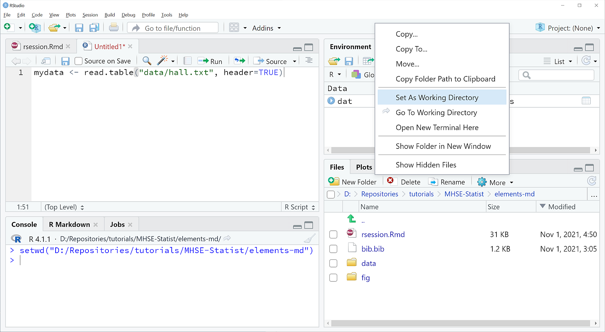
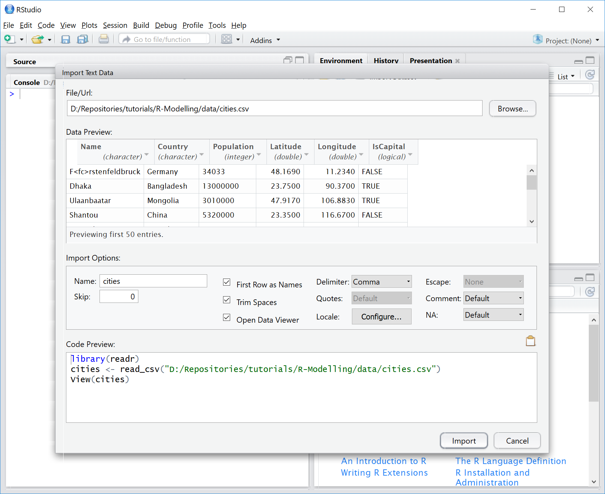

```{r setup, include=FALSE}
library("knitr")
knitr::opts_chunk$set(echo = TRUE, eval=FALSE, comment="")
```


# Introduction

The following section is intended to give you a first feeling what **R** [@RCore2021]
is and how it works. It assumes that the following software is installed:

1. The R system for statistical computing:  https://www.r-project.org
2. R Studio, a program that makes working with R more convenient: https://www.rstudio.org

Note: please install **R** first before installing **RStudio**.

You may also consider to watch a Youtube video about **R**, a
good example for the very beginning is the short video
"R tutorial - The True Basics of R"
from DataCamp, see https://youtu.be/SWxoJqTqo08.

# First Steps

## Program start and help system

The easiest way to learn **R** is the creative understanding and
modification of given examples, the usage of **R** for solving
practical problems and the diagnosis of the frequently occurring problems and
error messages. Don't worry: error messages are a normal phenomenon in
scientific computing and not an indication of a dysfunction of the
computer or the human brain. The opposite is true,
a certain amount of stress hormones helps to acquire permanent
learning effects.  Then, after a certain level of experience reading
the official **R**-Documentation "An Introduction to R" [@Venables2021].
or any good **R**-book is strongly recommended.

The first sections of this "crash course" are intended to give an
overview over some of the most important elements of **R** and an
insight into a typical work flow, that may be useful for the first
statistical analyses and as a starting point for self-education.

We begin our first session by starting **RStudio**, a platform
independent interface that makes working with R easier. RStudio
divides the screen into 3 (resp. 4) windows (called panes), where some
of them have additional tabs to switch between different views.


**Figure 1:** R Studio with 4 panes. Use **File -- New R Script** to open the the source 
code pane (shown top left). Then enter some code and don't forget to explore the help files.


In a fresh RStudio session, one "Pane" should be the main help page
of **R**.  It is a good idea to browse a little bit around to get an
impression about the amount and the typical style of the available
help topics.  The most important sections are "An Introduction to
R", "Search Engine \& Keywords", "Packages", the "Frequently
Asked Questions" and possibly "**R** Data Import/Export".

We start now to explore the **R**-System itself.


## R as a pocket calculator

Entering an arithmetic expression like this:

```{r pocketcalc, eval=FALSE, fig=FALSE, echo=TRUE, keep.source=TRUE}
2 + 4
```

shows that **R** can be used as a pocket calculator, that immediately
outputs the result:

```{r pocketcalc, eval=TRUE, echo=FALSE}
```

Instead of printing the result to the screen, it is also possible to
save the result into a named **variable** using the assignment
operator "`<-`".

```{r eval=TRUE, fig=FALSE, echo=TRUE, keep.source=TRUE}
a <- 2 + 4
```

It seems that nothing happens, but the result is now saved in the
variable `a` that can be recalled at any time by entering the
variable name alone:

```{r fig=FALSE,echo=TRUE,keep.source=TRUE}
a
```


Variable names in **R** start always with a character (or for special
purposes a dot), followed by further characters, numerals, dots or
underscores, where a distinction is made between small and capital
letters, i.e. the variables `value`, `Value` and `VALUE` can
contain different data.  A few character combinations are **reserved
words** and cannot be used as variables: 

`break`, `for`, `function`,
  `if`, `in`, `next`, `repeat`, `while` and "`\dots`" (three
dots). 

Other identifiers like `plot` can be re-defined, but
this should be done with care to avoid unwanted confusion and side effects.


## Vectors

You may have noticed, that the output of the example above had a
leading `[1]`, which means that the line begins with the first
element of `a`.  This brings us to a very important feature of
**R** that variables can contain more than single values:
vectors, matrices, lists, data frames (tables) and so on.


The most basic data type is the vector, that can be filled with data
using the `c` (combine) function:

```{r eval=TRUE, fig=FALSE, echo=TRUE}
values <- c(2, 3, 5, 7, 8.3, 10)
values
```

To create a sequence of values, one can use the `:` (colon):

```{r fig=FALSE, echo=TRUE}
x <- 1:10
x
```

or, even more flexibly the `seq` function:

```{r fig=FALSE, echo=TRUE}
x <- seq(2, 4, 0.25)
x
```

Sequences of repeated equal values can be obtained with `rep`:

```{r fig=FALSE, echo=TRUE}
x <- rep(2, 4)
x
```

## Exercise

There are many ways to use these functions, try for example:

```{r eval=FALSE,fig=FALSE,echo=TRUE}
seq(0, 10)
seq(0, 10, by = 2)
seq(0, pi, length = 12)
rep(c(0, 1, 2, 4, 9), times = 5)
rep(c(0, 1, 2, 4, 9), each = 2)
rep(c(0, 1, 2, 4, 9), each = 2, times = 5)
```

## Access to vector elements

Instead of accessing vectors as a whole, it is also possible to
extract single elements, where the index of the requested data is
itself a vector:

```{r fig=FALSE, echo=TRUE}
values[5]
values[2:4]
values[c(1, 3, 5)]
```

Sometimes, elements of a vector may have individual names, which makes
it easy to access them:

```{r fig=FALSE, echo=TRUE}
named <- c(a = 1, b = 2.3, c = 4.5)
named
named["a"]
```

In **R** (and in contrast to other languages like **C/C++**) vector indices
start with 1.  Negative indices are also possible, but they have the
special purpose to delete one or several elements:

```{r fig=FALSE, echo=TRUE}
values[-3]
```

It is also possible to extend a given vector by preceding or appending
values with the combine function (`c`):

```{r fig=FALSE, echo=TRUE}
c(1, 1, values, 0, 0)
```

The length of a vector can be determined with:

```{r fig=FALSE, echo=TRUE}
length(values)
```

and it is also possible to have empty vectors, i.e. vectors that
exist, but do not contain any values. Here the keyword `NULL`
means "nothing" in contrast to "0" (zero) that has length 1:

```{r fig=FALSE, echo=TRUE}
values <- NULL
values
length(values)
```

Such empty vectors are sometimes used as "containers" for appending
data step by step:

```{r fig=FALSE, echo=TRUE}
values <- NULL
values
length(values)
values <- c(values, 1)
values
values <- c(values, 1.34)
values
```

If a data element should be removed completely, this can be done using
the `remove` function:

```
rm(values)
values
Error: Object "values" not found
```

The complete workspace can be deleted from the menu of **R** or **RStudio** (Session -- Clear workspace) or
from the command line with `rm` (remove):

```{r fig=FALSE, echo=TRUE}
rm(list = ls(all = TRUE))
```

The **R** session can be closed by using the menu as usual or by
entering:

```{r, eval=FALSE}
q()
```

Sometimes and depending of the configuration, **R** asks whether the
"**R** workspace" should be saved to the hard disk. This may
be useful for continuing work at a later time, but has the risk to
clutter the workspace and to get irreproducible results at a later
session, so it is recommended to say "No" for now, except if you
exactly know why.

Later we will learn how to save only the data (and commands) that are
needed.


# Graphics

Now, we will see how to use **R** as a function plotter by drawing
sine or cosine functions within an interval between 0 to 10. First,
we create a table of values for `x` and `y` and in order
to get a smooth curve, it is reasonable to choose a small step size. As
a rule of thumb I always recommend to use about 100...400 small steps
as a good compromise between smoothness and memory requirements, so
let's set the step size to 0.1:

```{r eval=TRUE, fig=TRUE, echo=TRUE, keep.source=TRUE}
x <- seq(0, 10, 0.1)
y <- sin(x)
plot(x, y)
```

Instead of plotting points, it is of course also possible to draw
cotinuous lines.  This is indicated by supplying an optional argument
`type="l"`.  **Please note**, that the symbol used here for
`type` is the **small letter "L"** for "line" and not
the -- in printing very similar -- numeral "1" (one)!

We see also, that optional arguments like `type` can be given as
"keyword = value" pair. This has the advantage that the order of
arguments does not matter, because arguments are referenced by their name:

```{r eval=FALSE, fig=FALSE, echo=TRUE, keep.source=TRUE}
plot(x, y, type = "l")
```

Now we want to add a cosine function with another color. This can be
done with one of the function `lines` or `points`, for
adding lines or points to an existing figure:

```{r eval=FALSE, fig=FALSE, echo=TRUE, keep.source=TRUE}
y1 <- cos(x)
lines(x, y1, col = "red")
```

With the help of `text` it is also possible to add arbitrary
text, by specifying first the x and y coordinates and then the text:

```{r eval=FALSE, fig=FALSE, echo=TRUE, keep.source=TRUE}
x1 <- 1:10
text(x1, sin(x1), x1, col = "green")
```

Many options exist to modify the behavior of most graphics functions
so the following specifies user-defined coordinate limits
(`xlim`, `ylim`), axis labels and a heading (`xlab`, `ylab`,
`main`).

```{r eval=FALSE, fig=FALSE, echo=TRUE, keep.source=TRUE}
plot(x, y, xlim = c(-10, 10), ylim = c(-2, 2),
    xlab = "x-Values", ylab = "y-Values", main = "Example Graphics")
```

## Code formatting and line breaks

The above example is a rather long command and may not fit on a single
line.  In such cases, **R** displays a `+` (plus sign) to
indicate that a command must be continued, e.g. because a closing
parenthesis or a closing quote is still missing. Such a `+` at
the beginning of a line is an automatic "prompt" similar to the
ordinary `>` prompt and must never be typed in manually. If, however, the
`+` continuation prompt occurs by accident, press "ESC" to cancel this mode.

In contrast to the long line continuation prompt, it is also possible
to write several commands on one line, separated by a semi-colon
"`;`". This is unseful in some cases, but as a general rule it is better to

* write each command to a separate line
* avoid long lines with more than about 60 characters
* use proper indentation, e.g. 2 characters per indentation level

Finally, a number (or hash) symbol `#` means that a complete line or the
part of the line that follows `#` is a comment and should be
ignored by **R**.

## Additional plotting options

In order to explore the wealth of graphical functions, you may now
have a more extensive look into the online help, especially regarding
`?plot` or `?plot.default`, and you should experiment a
little bit with different plotting parameters, like `lty`,
`pch`, `lwd`, `type`, `log` etc. **R**
contains uncountable possibilities to get full control over the style
and content of your graphics, e.g. with user-specified axes
(`axis`), legends (`legend`) or user-defined lines and
areas (`abline`, `rect`, `polygon`). The general
style of figures like (font size, margins, line width) can be
influenced with the `par` function.

## High level plotting functions

In addition, **R** and its packages contain numerous "high
level"-graphics functions for specific purposes.  To demonstrate a
few, we first generate a data set with normally distributed random
numbers (`mean = 0`, standard deviation `sd = 1`), then we plot them and create a
histogram.  Here, the function `par(mfrow = c(2, 2))` divides the
plotting area into 2 rows and 2 columns to show 4 separate
figures:

```{r eval=FALSE, echo=TRUE, keep.source=TRUE}
par(mfrow = c(2, 2))
x <- rnorm(100)
plot(x)
hist(x)
```

Now, we add a so-called *normal probability plot* and a second
histogram with relative frequencies together with the bell-shaped
density curve of the standard normal distribution. The optional
argument `probability = TRUE` makes sure that the histogram has
the same scaling as the density function, so that both can be
overlayed:

```{r eval=FALSE, echo=TRUE, keep.source=TRUE}
qqnorm(x)
qqline(x, col = "red")
hist(x, probability = TRUE)
xx <- seq(-3, 3, 0.1)
lines(xx, dnorm(xx, 0, 1), col = "red")
```

<!-- and the same as hidden code chunk for a figure -->
```{r eval=TRUE, echo=FALSE}
par(mfrow = c(2, 2))
set.seed(123)
x <- rnorm(100)
plot(x)
hist(x)
qqnorm(x)
qqline(x, col = "red")
hist(x, probability = TRUE)
xx <- seq(-3, 3, 0.1)
lines(xx, dnorm(xx, 0, 1), col = "red")
```


Here it may also be a good chance to do a little bit summary
statistics like: z.B. `mean(x)`, `var(x)`,
`sd(x)`, `range(x)`, `summary(x)`,
`min(x)`, `max(x)`, ...

Or we may consider to test if the generated random numbers `x`
are approximately normal distributed using the Shapiro-Wilks-W-Test:

```{r fig=FALSE,echo=FALSE,include=FALSE}
set.seed(123)
```


```{r fig=FALSE, echo=TRUE}
x <- rnorm(100)
shapiro.test(x)
```

A p-value bigger than 0.05 tells us that the test has no objections
against normal distribution of the data.  The concrete results may
differ, because `x` contains random numbers, so it makes sense
to repeat this several times. It can be also useful compare these
normally distributed random numbers generated with `rnorm` with
uniformly distributed random numbers generated with `runif`:


```{r eval=FALSE, fig=FALSE, echo=TRUE, keep.source=TRUE}
par(mfrow=c(2,2))
y <- runif(100)
plot(y)
hist(y)
qqnorm(y)
qqline(y, col="red")
mean(y)
var(y)
min(y)
max(y)
hist(y, probability=TRUE)
yy <- seq(min(y), max(y), length = 50)
lines(yy, dnorm(yy, mean(y), sd(y)), col = "red")
shapiro.test(y)
```

At the end, we compare the pattern of both data sets with
box-and-whisker plots:

```{r eval=FALSE, fig=FALSE, echo=TRUE, keep.source=TRUE}
par(mfrow=c(1, 1))
boxplot(x, y)
```

## Exercise

Repeat this example with new random numbers and
vary sample size (`n`), mean value (`mean`) and standard
deviation (`sd`) for random numbers created with `rnorm`, and use different
`min` and `max` for `runif`. Consult the help
pages for an explanation of the functions and its arguments, and create boxplots
with different data sets.

\pagebreak

# Basic Data Structures of **R**

In addition to vectors, **R** contains several other classes of objects
for saving data, e.g. `matrix`, `array`, `list` or `data.frame`.
Both, "base **R**" and contributed packages contain many more classes. It is also possible to
define user-defined classes.

All objects have the two built-in attributes `mode` (data type)
and `length` (number of data in the object).  Under specific
circumstances some of these data types can be converted into each
other, e.g. by using functions like `as.matrix`,
`as.data.frame` etc.

Modes can be "numeric" for calculations or "character" for text elements. 
A special kind of mode is `factor`. This is, statistically speaking, a nominal variable
that appears like characters (e.g. "control", "treatment A", "treatment B" ...),
but its **levels** are internally encoded as integer. 
Conversion of such factors into other data types should be done with care, because
a character "123" may be encoded with another value (e.g. 1) and not 123, see the following
demonstration of a correct and wrong factor conversions:

```{r eval=FALSE}
x <- c(2, 4, 6, 5, 8)
f <- as.factor(x)
as.numeric(f)               # wrong !!!
as.numeric(as.character(f)) # correct
as.numeric(levels(f))[f]    # even better
```

This type of factor coding is not specific to R and appears also in other
statistics packages. Attributes of objects can be accessed and changed with functions
`attributes` and `attr`, classes with `class`:

```{r}
attributes(f)
attr(f, "class")
class(f)
```

The different classes allow specific operations, e.g. set operations with lists, 
matrix algebra with numeric matrices or text operations with character data.
In the following we focus on tables (in **R** called `data.frame`), the typical 
input format for statistical anlyses.


# Entering Data

Several different methods exist to input data into **R**.  The most
important are extensively explained in a special manual [**R** Data
Import/Export](https://cran.r-project.org/doc/manuals/r-release/R-data.html) 
and we want to show only a selection here:


1. direct input in the **R** code,
2. input from the clipboard,
3. input from a text file.


Other methods are direct data base access, import of data from other
statistics packages like SPSS, SAS or Stata
(`library(foreign)`), reading of GIS-Shapefiles
(`library(shapefiles)`), and even sound files or pictures.

## Direct input

We used this method already when creating vectors with the `c`
(combine)-Function:

```{r fig=FALSE, echo=TRUE, keep.source=TRUE}
x <- c(1, 2, 5, 7, 3, 4, 5, 8)
x
```

In the same way it is possible to create other data types like data
frames:

```{r fig=FALSE, echo=TRUE, keep.source=TRUE}
dat <- data.frame(f = c("a", "a", "a", "b", "b", "b"),
                  x = c(1,   4,   3,   3,   5,   7)
       )
dat
```

or matrices:

```{r fig=FALSE, echo=TRUE, keep.source=TRUE}
A <- matrix(c(1:9), nrow=3)
A
```

We see that a matrix is not much different from a vector, formatted into rows and columns.


## Copy and Paste from the Clipboard

**R** is able to read data directly from the clipboard that were pasted
from an editor or a spreadsheet program like Excel or
LibreOffice. Let's for example create a spreadsheet table from the
following example that contains some data from a lake area in
north-eastern Germany (Table 1).


**Table 1:** Morphometrical and chemical properties of selected lakes
(S=Stechlinsee, NN=Nehmitzsee Nord, NS=Nehmitzsee Süd, BL=Breiter
Luzin, SL = Schmaler Luzin, DA = Dagowsee, HS = Feldberger
Haussee; z=mean depth (m), t=theoretical retention time (a),
P=phosphorus concentration ($\mathrm{\mu g L^{-1}}$), N=nitrogen concentration ($\mathrm{mg L{^-1}}$),
Chl=chlorophyll concentration ($\mathrm{\mu g L^{-1}}$), PP=annual primary production
($\mathrm{g C m^{-2} a^{-1}}$), SD = secchi depth (m)). The data are an adapted 
and simplified "toy version" taken from @Casper1985 and @Koschel1985.


```{r, eval=TRUE, echo=FALSE, include=TRUE}
dat <- read.csv("data/lakes.csv")
kable(dat)
```


We now select the data and copy them to the clipboard (right mouse,
copy), then we change to **R** and retrieve the content of the
clipboard with the following command line:

```{r eval=FALSE, fig=FALSE, echo=TRUE, keep.source=TRUE}
dat <- read.table("clipboard", header = TRUE)
```

The character argument `"clipboard"` is the file name for the
data source, `header=TRUE` tells us that the first line contains
the variable names. In some countries that have the comma and not the
dot as a decimal separator, an additional argument `dec = ","`
may be required.

Now, the data are saved in the data frame `dat`
and it is possible to access them as usual:

```{r eval=FALSE, fig=FALSE, echo=TRUE, keep.source=TRUE}
dat
summary(dat)
boxplot(dat[-1])
```

Here `summary` shows a quick overview and `boxplot` creates a boxplot for all 
columns except the first, that contains no numbers.

## Read from a textfile

Reading from the clipboard sounds attractive, but it has a big
disadvantage because it needs several manual steps and cannot be
automated.  Therefore, it is much better to first save the data to a
text file on the hard disk before using read table. In the same way it
is also possible to read text files directly from the internet.


## Set working directory

Sometimes, it is necessary to know the full path to the data set, but
it preferred to set the **working directory** of **R** to the data
directory. This can be done in **RStudio** like follows:

1. Locate the folder in the "Files" pane
2. Select "More"
3. Select "Set As Working Directory"


**Figure2:** Setting the working directory in **RStudio**

After this, data can be retrieved directly from the **working directory ** (e.g. `read.csv("hall.csv")`) or from a sub-folder relative to it:

```{r eval=FALSE, fig=FALSE, echo=TRUE, keep.source=TRUE}
mydata <- read.table("data/hall.txt", header=TRUE)
```

Note also that we use always the ordinary slash "/" and not the backslash "\\", even
on Windows. It is also possible to use a file browser dialog box to locate and select a data file:

```{r eval=FALSE, fig=FALSE, echo=TRUE, keep.source=TRUE}
mydata <- read.csv(file.choose(), header=TRUE)
```

However, this has, again, the disadvantage that it cannot be automated.

If the data are available on an internet server, it can be read
directly from there:

```{r eval=FALSE, fig=FALSE, echo=TRUE, keep.source=TRUE}
mydata <- read.csv("https://raw.githubusercontent.com/tpetzoldt/datasets/main/data/hall.csv", 
                   header=TRUE)
```

Now, we are ready to inspect the content of this new variable `mydata`:

```{r eval=FALSE, fig=FALSE, echo=TRUE, keep.source=TRUE}
View(mydata)
```

In **RStudio** `View` can also be invoked by clicking to `mydata` in
the environment window.

Function `View` opens a table view, because `mydata` is a
data frame. The data set `hall.txt` contains growth curves from
an experiment with Daphnia (water flea) that were taken from a figure of a publication
@Hall1964, where body length was mesured in dependence on time (`day`),
temperature (`temp`) and food concentration (`food`), that was measured in
a historical turbidity unit "Klett"), but this does not matter
for our example.


## "Import Dataset" in RStudio

**RStudio** contains a handy feature that makes importing of data more
convenient.  Essentially, this "Import Dataset" wizard helps us to
construct the correct `read.table`, `read.csv` or `read_delim` function
interactively. It is possible to try
different options until a satisfying result is obtained. Current versions of 
**RStudio** contain several different ways to import data. Here we demonstrate
the "Import Dataset From Text (readr)" assistant:

1. From the menu select: File -- Import DataSet -- From CSV.
2. Select the requested file and select suitable options like the name of the variable the data are to be assigned to, the delimiter character (comma or Tab) and whether the first row of the file contains variable names.
3. Hint: The Code Preview contains the commands that the wizard created. If you copy these commands to the
 script pane, you can re-read the data several times without going back to the menu system.




Import Dataset From Text (readr) assistant of **RStudio**.

Hint: Do not forget to set a **Name** for the resulting data frame
(e.g. `dat`), otherwise **R** uses the file name.


# Working with Dataframes

For large tables it is often not very useful to display the full
content, so it is much better to use the function `str`
(structure) or the "Environment" explorer of **RStudio** that gives a compact 
overview over type, size and content of a variable:

```{r eval=FALSE, fig=FALSE, echo=TRUE, keep.source=TRUE}
str(mydata)
```

This function is universal and also suitable for complicated
object types like lists. Of course, there are many more possibilities
for inspecting the content of a variable:

```{r eval=FALSE, fig=FALSE, echo=TRUE, keep.source=TRUE}
names(mydata)
mode(mydata)
length(mydata)
```

and sometimes even:

```{r eval=FALSE, fig=FALSE, echo=TRUE, keep.source=TRUE}
plot(mydata)
```

## Access single columns with $

Single columns of a data frame can be accessed by using indices (with
`[]`) similar to a vector or a matrix or by using the column name
and the `$`) operator:

```{r eval=FALSE, fig=FALSE, echo=TRUE, keep.source=TRUE}
mean(mydata[,4])
mean(mydata$leng)
mean(mydata[,"leng"])
mean(mydata[["leng"]])
plot(mydata$day, mydata$leng)
```

Note the difference of the output of the `[]` and the `[[]]`-
version.  The difference is as follows: single brackets return a data
frame with one column, but double square brackets return the content
of the column, i.e. a vector.

The `$`-style can be abbreviated using the `attach` and `detach`-functions,
but this "prehistoric relict" is strongly discouraged, as it can lead to data 
inconsistency and strange errors. If you find it somewhere where it is still 
used, then it is a good idea to use `detach` repeatedly until an error message 
confirms us that there is nothing else that can be detached. Finally: never use 
`attach/detach` in a package.

Instead, it is much better to use another function `width`, that opens
the data frame only temporarily:

```{r eval=FALSE, fig=FALSE, echo=TRUE, keep.source=TRUE}
with(mydata, plot(day, leng))
```

Here we can also use curly brackets to combine a series of statements:

```{r eval=FALSE, fig=FALSE, echo=TRUE, keep.source=TRUE}
with(mydata, {
  print(mean(leng))
  print(sd(leng))
})
```

## Subsets and logical indices

A very powerful feature of **R** is the use of logical vectors as
"indices", with similar results like data base queries. A
prerequisite for this is that all vectors have the same length.

```{r eval=FALSE, fig=FALSE, echo=TRUE, keep.source=TRUE}
par(mfrow=c(1, 2))
with(mydata, {
  plot(day[temp == 20], leng[temp == 20])
  plot(day[temp == 20 & food == 16], leng[temp == 20 & food == 16])
})
```

A logical comparison requires always a double "`==`".
Logical operations like `&` (and) and `|` (or) are also
possible.  Note that "and" has always precedence before
"or", except this is changed with parenthesis.

A subset of a data frame can also be extracted with the
`subset` function:

```{r eval=FALSE, fig=FALSE, echo=TRUE, keep.source=TRUE}
twentydegrees <- subset(mydata, mydata$temp == 20)
View(twentydegrees)
```

Like in the example before, the condition argument allows also logical
expressions with `&` (and) and `|` (or).

At the end of this section we show how to convert a data frame into a
matrix and how to access single elements in matrix-like manner:

```{r eval=TRUE, fig=FALSE, echo=TRUE, keep.source=TRUE}
mydata   <- read.csv("data/hall.csv")
mymatrix <- as.matrix(mydata)
```

The element from the 2nd row and the 4th column can be selected with:

```{r fig=FALSE, echo=TRUE, keep.source=TRUE}
mymatrix[2, 4]
```

the complete 5th row with:

```{r fig=FALSE, echo=TRUE, keep.source=TRUE}
mymatrix[5, ]
```

and rows 5:10 of the 4th column (`leng`) with:

```{r fig=FALSE, echo=TRUE, keep.source=TRUE}
mymatrix[5:10, 4]
```


Additional methods for working with matrices, data frames and lists can
be found in **R** textbooks or in the official **R** documentation.


## Mean values of factor combinations

The last examples are intended to demonstrate how powerful a single
line can be in **R**.  Function `aggregate` can be used to compute
statistics (e.g. mean values) depending on given criteria. The first
argument of the function is a data frame containing numeric data, the
second argument a list (or data frame) of criteria (as factors) and
the third argument a function that will be applied to all possible
factor combinations, e.g., `mean`, `median`, `sd`,
`max` etc.

```{r eval=FALSE, fig=FALSE, echo=TRUE, keep.source=TRUE}
aggregate(mydata, list(food = mydata$food, temp = mydata$temp), mean)
```

or, because it is not meaningful here to calculate mean values
for temperature, food concentration and time:

```{r eval=FALSE, fig=FALSE, echo=TRUE, keep.source=TRUE}
aggregate(list(leng = mydata$leng),
          list(food = mydata$food, temp = mydata$temp), mean)
```

## Categorial plots

Categorical boxplots can be obtained by using the so-called
"formula-interface". The variable at the left hand side is the
dependent variable, while independent factors used for classification
are written at the right hand side. The formula is then read "leng
as a function of food and temp":

```{r eval=FALSE, fig=FALSE, echo=TRUE, keep.source=TRUE}
boxplot(leng ~ food + temp, data = mydata)
```

Many, but not all **R** -Functions support this formula interface, details are found 
in the documentation.

For categorial xy-plots, the formula syntax is also used in the the **lattice**-package [@Sarkar2008]:

```{r eval=TRUE, fig=TRUE, echo=TRUE, keep.source=TRUE}
library(lattice)
xyplot(leng ~ day|temp * food, data = mydata)
```

Though the lattice package has a rather complex syntax, it is also very
flexible and powerful, so the time to learn it is worth the effort. 
Instead of **lattice**, categorial plots can also be obtained with the **ggplot2** 
package. This will be explained later.

## Output of Results

The most simple method to save outputs from **R** is to copy
it directly from the **R** console to any other program (e.g.
LibreOffice, Microsoft Word or Powerpoint) via the Clipboard.
This is convenient, but cannot be automated. Therefore, it
is better to use a programmatic approach.

Data frames can be saved as text files with `write.table` or `write.csv`:

```{r echo=TRUE,eval=FALSE}
write.csv(mydata, file="output-data.csv", row.names = FALSE)
```


In addition to these basic functions **R** has a wealth of
possibilities to save output and data for later use in reports and
presentations. All of them are of course documented in the online
help, e.g.  `print`, `print.table`, `cat` for text files, and 
`pdf`, `png` for figures. The add-on packages
**xtable** contains functions for creating **LaTeX** or
HTML-tables while full HTML output is supported by the `R2HTML` or `knitr`
packages.


## Exercises


1. Explore different possibilities to plot the Hall-Data set.  Draw
  one figure for each temperature level and distinguish food
  concentration by using different colors, plot symbols or line types.
  Make use of the annotation options for adding axis labels and main
  titles.

2. **R** contains lots of data sets for exploring its graphical and
  statistical functions and that can be activated by using the
  data function, e.g.  `data(iris)`. Use this data set
  and find appropriate ways for visualization. A description of the
  data set can be found as usual in the help file `?iris`.

# Quitting an **R**-Session


The **R**-window can be closed as usual with the menu or by entering
`q()` (quit):

```{r eval=FALSE, fig=FALSE, echo=TRUE, keep.source=TRUE}
q()
```

Depending on the configuration, we may now be asked whether we want to
"Save workspace image" and answering "Yes" would force to save
all data from the **R**-Workspace into a file `.Rdata`, so that
all data will be automatically and immediately available in the next
session, given that **R** is started in the same working
directory. Alternatively it is also possible to save or restore an
**R**-Workspace manually into a file (Save Workspace, Load Workspace).

# Acknowledgments

This document was written in **RStudio** [@RStudio] with **RMarkdown** and the **knitr** package [@Xie2015].

# Bibliography

