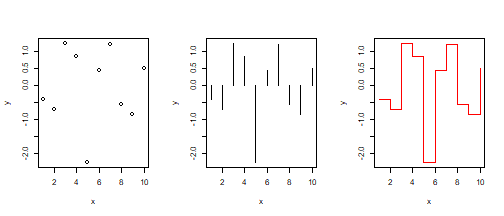
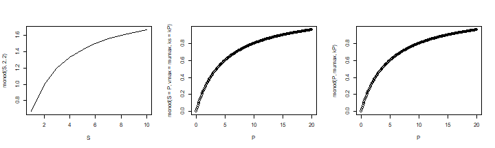
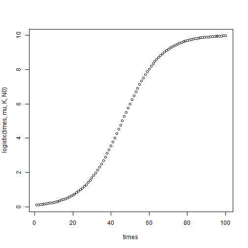

<script type="text/javascript" src="https://cdn.mathjax.org/mathjax/latest/MathJax.js?config=TeX-AMS-MML_HTMLorMML">
</script>


Functions Everywhere
========================================================
author: Thomas Petzoldt
date: 2020-11-04
width: 1024
height: 768
css: RBasics.css


Functions bring life to the R language
========================================================

sin(x), log(x), plot(x, y), summary(x), anova(lm.object), mean(x), monod(S, vmax, ks), simulate_phytoplankton(N, P, T, Zoo, .)


Functions in R

* have a name, followed by parenthesis ()
* can have 1, 2 or more arguments (or no argument)
* usually return something (an object)
* can have side-effects (e.g. plotting)


Types of functions
========================================================

Parentheses and arguments

* all functions are followed by parentheses and arguments
* functions: `log(x)` `par()`
* `par <- c(a=5, b=3) # par is a variable, c() a function`


Return value and/or side effect

* `sin(x)`, `log(x)`, `mean(x)` are functions with **return value**
* `print(x)`, `plot(x, y)` are functions with **side effect**
* `hist(x)` is a function with both, side effect and return value

Predefined and user-defined functions

* predefined: available in R
* user defined: users become programmers


Arguments of functions
========================================================


**Usage**

```r
dnorm(x, mean = 0, sd = 1, log = FALSE)
pnorm(q, mean = 0, sd = 1, lower.tail = TRUE, log.p = FALSE)
qnorm(p, mean = 0, sd = 1, lower.tail = TRUE, log.p = FALSE)
rnorm(n, mean = 0, sd = 1)
```
**Arguments**

|         |            |
---------- | -----------
x, q       | vector of quantiles.
p          | vector of probabilities.
n	         | number of observations. If length(n) > 1, the length is taken to be ...
log.p	     | logical; if TRUE, probabilities p are given as log(p).
lower.tail | logical; if TRUE (default), ...

**Examples**

```r
rnorm(10)                         # x given, other arguments = defaults
rnorm(10, 0, 1)                   # order matters
rnorm(n = 10, mean = 0, sd = 1)   # use argument names
rnorm(10, sd = 1, mean = 0)       # named arguments can be "out of order"
rnorm(10, m = 5, s = 1)           # abbreviated argument names = bad style
args(rnorm)                       # which arguments are supported by rnorm?
```

The ellipsis argument
========================================================


```r
plot(x, y, ...)
```

* Some functions have a ... argument, called "ellipsis".
* This means that additional arguments are passed to other functions.
* The mechanism is one of the sectrets, why R is so flexible and extensible, but
it is sometimes not trivial to read the docs.


```r
par(mfrow=c(1, 3))
x <- 1:10; y <- rnorm(10)
plot(x, y)
plot(x, y, type = "h")
plot(x, y, type = "s", col="red")
```




?plot.default
========================================================


```r
plot(x, y = NULL, type = "p",  xlim = NULL, ylim = NULL,
     log = "", main = NULL, sub = NULL, xlab = NULL, ylab = NULL,
     ann = par("ann"), axes = TRUE, frame.plot = axes,
     panel.first = NULL, panel.last = NULL, asp = NA, ...)
```

**Object orientation**

* `plot` is a **generic** function
* works *automagically* differentl for different classes of objects
* `plot.default` is the basic function
* `...` see `?par` for additional graphical parameters, e.g.:


|   |     |
--- | -----
`col` | color
`bg`  | background color for two-color symbols
`pch` | symbol (plotting character)
`cex` | size of symbol (character extension)
`lty` | line type
`lwd` | line width


A simple user-defined function
========================================================

The Monod functioin describes substrate dependence of biochemical turnover. It is widely used in biochemistry and in ecological models.

$$
v = \frac{v_{max} \cdot S}{k_S + S}
$$


```r
monod <- function(S, vmax, ks) {
  vmax * S / (ks + S)
}

par(mfrow=c(1, 3))
S <- 1:10
plot(S, monod(S, 2, 2), type="l")

# names of caller and function can be different
kP <- 5; mumax <- 1.2; P <- seq(0, 20, 0.1)
plot(P, monod(S=P, vmax=mumax, ks=kP)) # named arguments
plot(P, monod(P, mumax, kP))           # argument position
```




Seasonal Light Intensity in Dresden
========================================================

$$
I_t = 997 - 816 \cos(2 \pi t / 365) + 126 \sin(2 \pi t / 365)
$$


```r
irad <- function(t) {
  ## fill this in
}

t <- 1:365
plot(t, irad(t), type = "l")
```

Functions as a knowledge base

* put knowledge in function and use it
* forget what is inside

***


Oxygen saturation in fresh and sea water
========================================================

$$
c_{O_2, 100\%} = ... ?
$$


```r
o2sat <- function(t) {
  K <- t + 273.15 # Celsius to Kelvin
  exp(-139.34411 + (157570.1/K) - (66423080/K^2) +
   (1.2438e+10/K^3) - (862194900000/K^4))
}

o2sat(20)
```

```
[1] 9.092426
```

```r
## even better formula in package marelac
library(marelac)
gas_O2sat(t=20, S=0)
```

```
[1] 9.067446
```

```r
## another formula
gas_O2sat(t=20, S=0, method="APHA")
```

```
[1] 9.092426
```

consult `?gas_O2sat` for citations.

Local and global variables
========================================================

Variables in a function are **local**:

- not visible from outside.
- no collisions with existing variables in the calling environment

Lexical Scoping

- functions can see variables of the calling function
- useful for interactive work
- dangerous for (exported) functions in packages
- except in special cases, e.g. for functions within functions


Local and global variables
========================================================


```r
rm(list=ls()) # remove all objects
o2sat <- function(t) {
  K <- t + 273.15 # Celsius to Kelvin
  exp(-139.34411 + (157570.1/K) - (66423080/K^2) +
   (1.2438e+10/K^3) - (862194900000/K^4))
}

o2sat(20)
K

K <- 0
o2sat(20)
```

Now outcomment:

```r
# K <- t + 273.15
```
and try again.


Logistic growth
========================================================

The logistic growth function describes saturated growth of a population abundance
$N_t$, dependent of an initial value $N_0$. growth rate $r$ and carrying capacity $K$.

$$
N_t = \frac{K N_0 e^{rt}}{K + N_0 (e^{rt}-1)}
$$


```r
logistic <- function(t, r, K, N0) {
  K*N0*exp(r*t)/(K+N0*(exp(r*t)-1))
}


mu <- 0.1; K = 10; N0 = 0.1
times <- 1:100
```
***


```r
plot(times,
     logistic(times, mu, K, N0))
```



Functional response types in Ecology
========================================================

Holling type I $P = \min(k \cdot N, P_{max})$

Holling type II $P = \frac{\alpha N}{1 + \alpha H N}$

Holling type III $P = \frac{\alpha N^b}{1 + \alpha H N^b}$

with

|        |           |
-------- | ----------
$P$      | predation rate
$N$      | abundance of prey
$P_{max}$| maximum predation rate
$k$      | a constant
$\alpha$ | attack rate
$H$      | handling time
$b$      | exponent $>1$

* Write a function for each functional reponse type and plot it.
* Write a universal function for all types.

Further Reading
===============

More presentations:

* [R Basics](RBasics.html)
* [Graphics in R](Graphics.html)

More details in the official R manuals, especially in [**An Introduction to R**](https://cran.r-project.org/doc/manuals/r-release/R-intro.html)

Many videos can be found on [Youtube](https://www.youtube.com), on [Rstudio](https://rstudio.com/resources/webinars/) and somewhere else

This tutorial was made with R-Presentations of [RStudio](https://www.rstudio.org)

Author: tpetzoldt +++
[Homepage](https://www.tu-dresden.de/Members/thomas.petzoldt) +++
[Github page](https://tpetzoldt.github.io)
