<script type="text/javascript" src="https://cdn.mathjax.org/mathjax/latest/MathJax.js?config=TeX-AMS-MML_HTMLorMML">
</script>


Graphics in R
===================================
author: Thomas Petzoldt
date: 2019-11-05
width: 1024
height: 768
css: Graphics.css


Overview
===================================

1. The easy way
2. Customizing graphics
3. Multiple grapics on one page
4. Saving and exporting graphics
5. Lattice
6. grid and gridbase
7. ggplot2


Prerequisites
=============

The examples were tested with R 3.x

The data sets of this presentation are available:
* as built-in data in R or
* can be downloaded from [here](https://github.com/tpetzoldt/tpetzoldt.github.io/tree/master/RBasics/data)


The `radiation.txt' data set contains *derived* data from the German Weather
Service (<http://www.dwd.de>), station Dresden. Missing data were interpolated.


The Easy Way
===================================================================


```r
plot(iris)
```


---


**R** contains many graphics functions with convenient defaults.

`iris` is a built-in data set in **R** (see next slide)

`plot`is a so-called *generic function* that automatically decides how to plot.


The iris data set
===============================

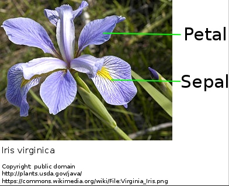

The famous (Fisher's or Anderson's) `iris` data set gives the measurements in centimeters of the variables sepal length and width and petal length and width, respectively, for 50 flowers from each of 3 species of iris. The species are Iris setosa, versicolor, and virginica. (from the **R** Helpfile)

* see `?iris` in **R**'s online help.
* or: https://en.wikipedia.org/wiki/Iris_flower_data_set

Plotting colums of a data frame
===============================


```r
plot(iris$Sepal.Length, iris$Petal.Length)
```

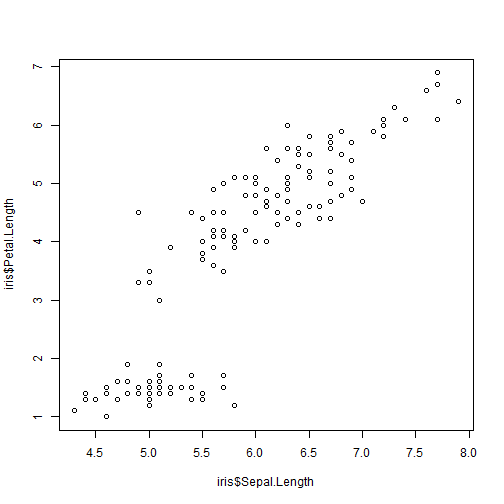

----


```r
plot(iris$Sepal.Length, iris$Petal.Length, col=iris$Species)
```

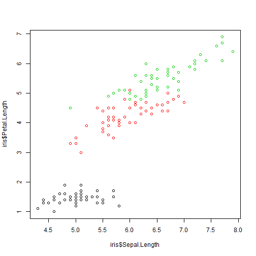

Using `with` saves dollars
===============================


```r
plot(iris$Sepal.Length, iris$Petal.Length, col=iris$Species)
```

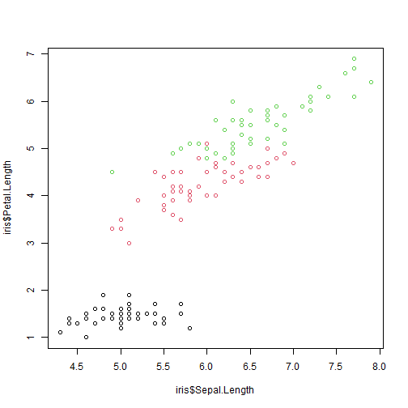

----


```r
with(iris, plot(Sepal.Length, Petal.Length, col=Species))
```

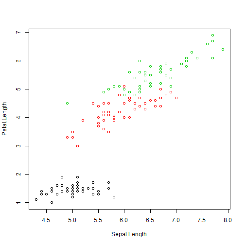

Colors and plotting symbols in R
================================

**R** allows to change style and color of plotting symbols:

* `col` = color, can be one of 8 default colors or a user-defined color
* `pch` = plotting character, can be one of 25 symbols or a quoted letter
* `cex` = character extension: size of a plotting character


```r
plot(1:25, col=1:25, pch=1:15, cex=2)
```

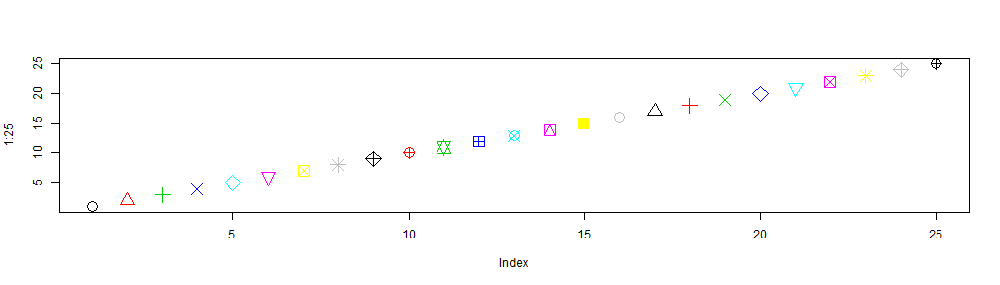


Colors and plotting symbols in R
================================

* symbols 21..25 have an optional background color
* `lwd` specifies the border width of the symbol


```r
plot(21:25, col="darkred", pch=21:25, cex=2, bg="green", lwd=2)
```


R as function plotter
=====================


```r
x <- seq(0, 20, length.out=100)
y1 <- sin(x)
y2 <- cos(x)
plot(x, y1, type="l", col="red")
lines(x, y2, col="blue")
```

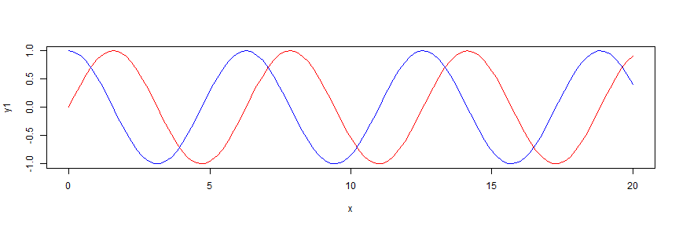

* <small>type: "p": points, "l": lines, "b": both, points and lines, "c": empty points joined by lines, "o": overplotted points and lines, "s" and "S": stair steps, "h" histogram-like vertical lines, "n": no points or lines.</small>

Line styles
=====================


```r
x <- seq(0, 20, length.out=100)
plot(x, sin(x), type="l", col="red", lwd=3, lty="dotted")
lines(x, cos(x), col="blue", lwd=2, lty="dashed")
```


<small>

* `lty` line type ("blank", "solid", "dashed", "dotted", "dotdash", "longdash", "twodash") or a number from 1...7,
   or a string with up to 8 numbers for drawing and skipping (e.g. "4224").
* `lwd` line width (a number, defaults to 1)

</small>


Coordinate axes and annotations
===============================


```r
plot(iris$Sepal.Length, iris$Petal.Length, xlim=c(0, 8), ylim=c(2,8),
     col=iris$Species, pch=16,
     xlab="Sepal Length (cm)", ylab="Petal Length (cm)", main="Iris Data",
     las = 1)
```

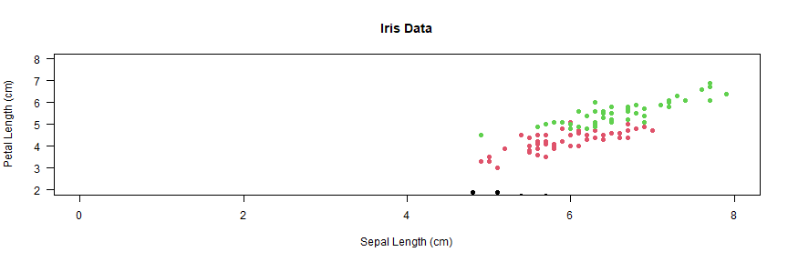

* `col=iris$Species` works because `Species` is a factor
* `las=1` numbers on y-axis upright (try: 0, 1, 2 or 3)
* `log` may be used to transform axes (e.g. log="x", log="y", log="xy")


Adding a legend
===============================


```r
mycolors <- c("blue", "red", "cyan")
plot(iris$Sepal.Length, iris$Petal.Length, xlim=c(0, 8), ylim=c(2,8),
     col=mycolors[iris$Species], pch = 16,
     xlab="Sepal Length (cm)", ylab="Petal Length (cm)", main="Iris Data",
     las = 1)
legend("topleft", legend=c("Iris setosa", "Iris versicolor", "Iris virginica"),
  col=mycolors, pch=16)
```

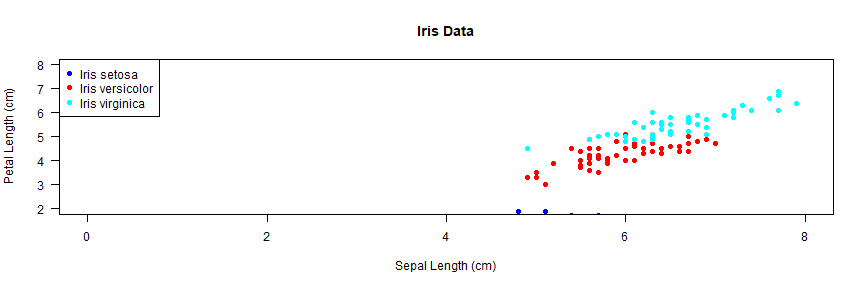

<small>

* see ?legend for more options (e.g. line styles, position of the legend)
* use `locator(1)` instead of `"topright"` for positioning the legend with the mouse

</small>


Global parameters, font size, margins, ...
================

* Many figure options can be specified globally with `par()`, see ?par
* `par(lwd=2)` all lines have double width
* `par(mfrow=c(2,2))` subdivides the graphics area in 2 x 2 fields
* `par(las=1)`  numbers at y axis upright
* `par(mar=c(5, 5, 0.5, 0.5))` changes figure margins (bottom, left, top, right)
* `par(cex=2)` increase font size
* $\rightarrow$ sometimes it is better to leave font size as is and change size
  of the figure instead


Example
===========================


```r
plot(iris$Sepal.Length, iris$Petal.Length, col=iris$Species)
```


-----


```r
opar <- par(cex=1.5, mar=c(4,4,0.2,1), las=1)
plot(iris$Sepal.Length, iris$Petal.Length, col=iris$Species)
```


```r
par(opar)
```


Saving and exporting figures
============================

Easiest way ist to use the RStudio's **Export --> Save as Image** (or copy to clipboard)

**Important:** Select correct image format and image size!

|Format       | Type   | Usage                         | Notes                                                |
|-------------|--------|-------------------------------|------------------------------------------------------|
| PNG         | bitmap | general purpose               | fixed size, use at least 300 pixels per inch         |
| JPEG        | bitmap | photographs                   | not good for R images                                |
| TIFF        | bitmap | PNG is easier                 | required by some journals                            |
| BMP         | bitmap | not recommended               | needs huge memory                                    |
| Metafile    | vector | Windows standard format       | easy to use, quality varies                          |
| SVG         | vector | can be edited                 | allows editing graphics with Inkscape                |
| EPS         | vector | PDF is easier                 | required by some journals                            |
| PDF         | vector | best quality                  | perfect for LaTex, MS Office requires conversion     |


Writing figures directly to PDF
===============================


```r
pdf("myfile.pdf", width=8, height=6)
par(las=1)
plot(iris$Sepal.Length, iris$Petal.Length, col=iris$Species)
dev.off()
```

* width and height in inch (1 inch = 2.54cm)
* professional quality, size can be changed without quality loss
* conversion to PNG can be done later with free programs (e.g. Inkscape, SumatraPDF or ImageMagick)


Writing figures directly to PNG
===============================


```r
png("myfile.png", width=1600, height=1200, res=300)  # good for Word
#png("myfile.png", width=800, height=600, res=150)   # good for Powerpoint
par(las=1)
par(mar=c(5, 5, 1, 1))
plot(iris$Sepal.Length, iris$Petal.Length)
dev.off()
```


* width and height given in pixels
* **Hint:** play with `res` to change nominal resolution and font size
* use at least 300 dpi (dots per inch, i.e. number of pixels = 300/2.54 * width in cm)
* professionals use 600 or even 1200 pixels per inch, but then .docx and .pptx files will dramatically increase
* 1600 x 1200px is good for 13.3 x 10 cm size in the printed document


Example: Global Radiation Data at Dresden
===================


```r
radiation <- read.table("data/radiation.txt", sep="\t", header=TRUE)
radiation$Date <- as.Date(radiation$date)
```


```r
plot(radiation$Date, radiation$rad)
```

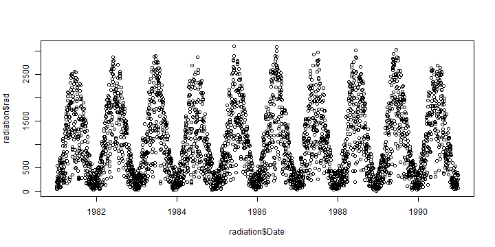

Note: The data set contains *derived* data from the German Weather Service (<http://www.dwd.de>), station Dresden. Missing data were interpolated.


More About Date and Time
===================================================================
type: prompt

* `date and time classes in R:
  - `as.Date`
  - `as.POSIXct`
* `format` and `strptime`
* extract day, month, year, Julian day
* time series objects `tseries`and `zoo`


format and strptime
===================================================================


```r
format(x, format = "", tz = "", usetz = FALSE, ...)
```

|           |                                   |
----------- | ----------------------------------
 %Y         | year with century
 %m         | month as decimal number
 %d         | day of the month
 %H         | hours as decimal number (00-23)
 %M         | minute as decimal number (00-59)
 %S         | second as decimal number (00-59)
 %j         | day of year (001-366)
 %u         | weekday, Monday is 1


```r
as.Date("11.03.2015", format="%d.%m.%Y")
```

```
[1] "2015-03-11"
```

Date conversion for the solar radiation data set
================================================


```r
radiation$year <- format(radiation$Date, "%Y")
radiation$month <- format(radiation$Date, "%m")
radiation$doy <- format(radiation$Date, "%j")
radiation$weekday <- format(radiation$Date, "%u")

head(radiation)
```

```
        date rad interpolated       Date year month doy weekday
1 1981-01-01 197            0 1981-01-01 1981    01 001       4
2 1981-01-02  89            0 1981-01-02 1981    01 002       5
3 1981-01-03  49            0 1981-01-03 1981    01 003       6
4 1981-01-04 111            0 1981-01-04 1981    01 004       7
5 1981-01-05 161            0 1981-01-05 1981    01 005       1
6 1981-01-06  55            0 1981-01-06 1981    01 006       2
```


aggregate
===================================================================

**Syntax**


```r
aggregate(x, by, FUN, ..., simplify = TRUE)
```

**Example**


```r
yearmax <- aggregate(
  list(rad = radiation$rad),
  list(year = radiation$year),
  max)

monmean <- aggregate(
  list(radiation = radiation$rad),
  list(year = radiation$year, month = radiation$month),
  mean)
```

* aggregate is essentially a wrapper to `apply`


Plot aggregated radiation data
===============================


```r
par(mfrow=c(1,2), las=1)
boxplot(rad ~ year, data=radiation)
boxplot(rad ~ month, data=radiation)
```

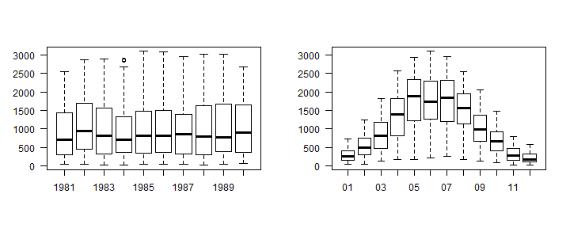

Most functions that support a formula argument (containing `~`) allow to specify
the data frame with a `data` argument.


More about Plotting
===================================================================
type: prompt

* **base graphics**
* package **lattice**
* package **ggplot2**
* Manipulation of plots
  - set size and fonts; save plots to disk
  - use pdf, svg or png -- not jpg - except for photographs
* Related software
  - edit/convert svg (and pdf) with **Inkscape**
  - convert images with **ImageMagick**


Base Graphics
===================================================================


```r
x <- rnorm(100)
par(mfrow=c(2,2))
plot(x)
hist(x)
qqnorm(x)
boxplot(x)
```

***

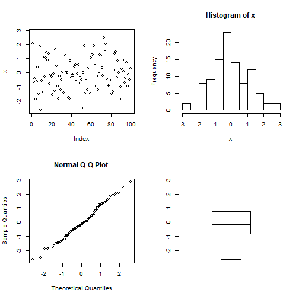


grid and gridBase
===================================================================

* complete freedom to organise plotting area
* interface relatively raw
* basis of other plotting packages
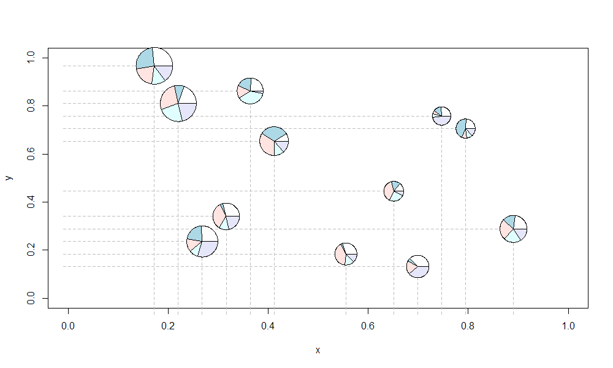


Lattice Graphics
===================================================================

* Implements "trellis graphics" (i.e. gridded graphics) in R
* Sarkar, D. (2008). Lattice: multivariate data visualization with R. Springer Science & Business Media.


```r
require(lattice)
data(iris)
xyplot(Sepal.Length ~ Sepal.Width|Species, data=iris, layout=c(3,1))
```

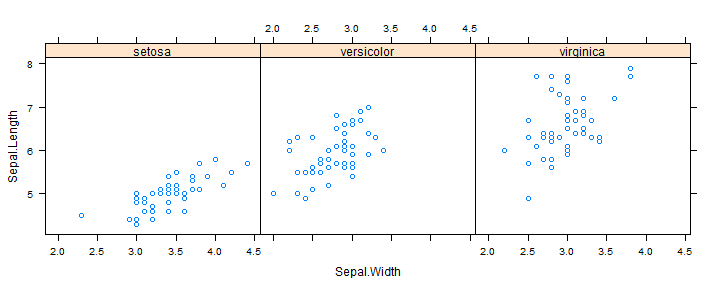


ggplot2
===================================================================

* Implements the "Grammar of Graphics"
  - Leland Wilkinson (2005) The Grammar of Graphics. 2nd edn. Springer
  - Hadley Wickham (2009) ggplot2: Elegant Graphics for Data Analysis. Springer.
* https://ggplot2.tidyverse.org/


===================================================================
title: FALSE


```r
library(ggplot2)
data(iris)
ggplot(iris, aes(Sepal.Length, Sepal.Width, color=factor(Species))) + geom_point() + stat_smooth(method="lm")
```

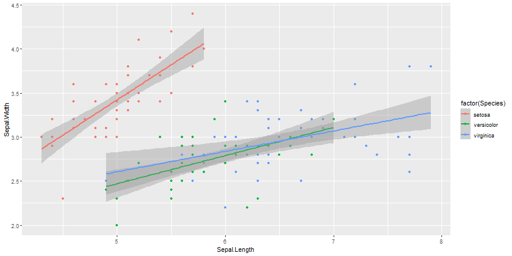


===================================================================
title: FALSE


```r
library(ggplot2)
radiation <- read.table("data/radiation.txt", sep="\t", header=TRUE)
radiation$date <- as.Date(radiation$date)
radiation$year <- format(radiation$date, "%Y")
radiation$doy <- as.numeric(format(radiation$date, "%j"))
ggplot(radiation, aes(doy, rad)) + geom_line() + facet_wrap(.~year)
```

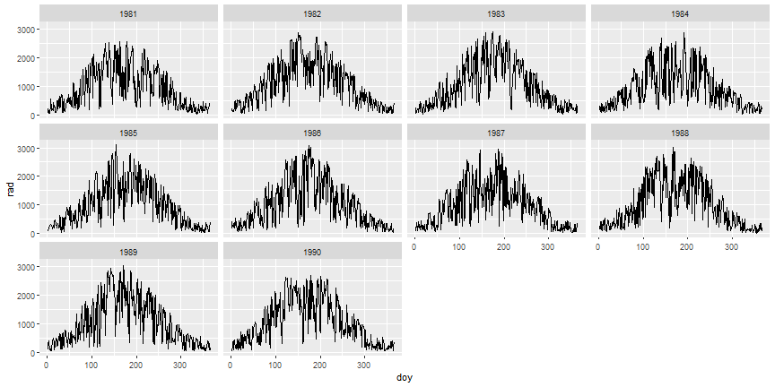


Save Images to Disk
===================================================================

* Simple: use of RStudio's graphics export
* Better:


```r
pdf(file="figure.pdf",width=8,height=6) # open
plot(rnorm(100))                        # plotting
dev.off()                               # close
```

* other graphics formats: `png()`, `svg()`, ...
* pdf allows several plots in one file (until dev.off)
* special formats possible,
  e.g. `width=100, height=10` (useful for `hclust`)
* in case of error: repeated `dev.off()` to close all files.


Vector vs. Bitmap Graphics
===================================================================

**Bitmap formats**

* jpg, png, tiff
* fixed resolution, cannot be magnified without loss
* retouching possible, but not editing
* well suited for pictures or plots with huge number of data (color maps)
* cannot be converted to vector without complications and quality loss

**Vector formats**

* svg, pdf, [wmf, emf]
* can be up- and downscaled and edited
* well suited drawings and diagrams (except if huge amount of data)
* can always be converted to bitmap


Further Reading
===============

More presentations:

* [R Basics](RBasics.html)
* [Functions everywhere](Functions.html)


More details in the official R manuals, especially in [**An Introduction to R**](https://cran.r-project.org/doc/manuals/r-release/R-intro.html)

Many videos can be found on [Youtube](https://www.youtube.com), on [Rstudio](https://rstudio.com/resources/webinars/) and somewhere else

This tutorial was made with R-Presentations of [RStudio](https://www.rstudio.org)

Author: tpetzoldt +++
[Homepage](https://www.tu-dresden.de/Members/thomas.petzoldt) +++
[Github page](https://tpetzoldt.github.io)


