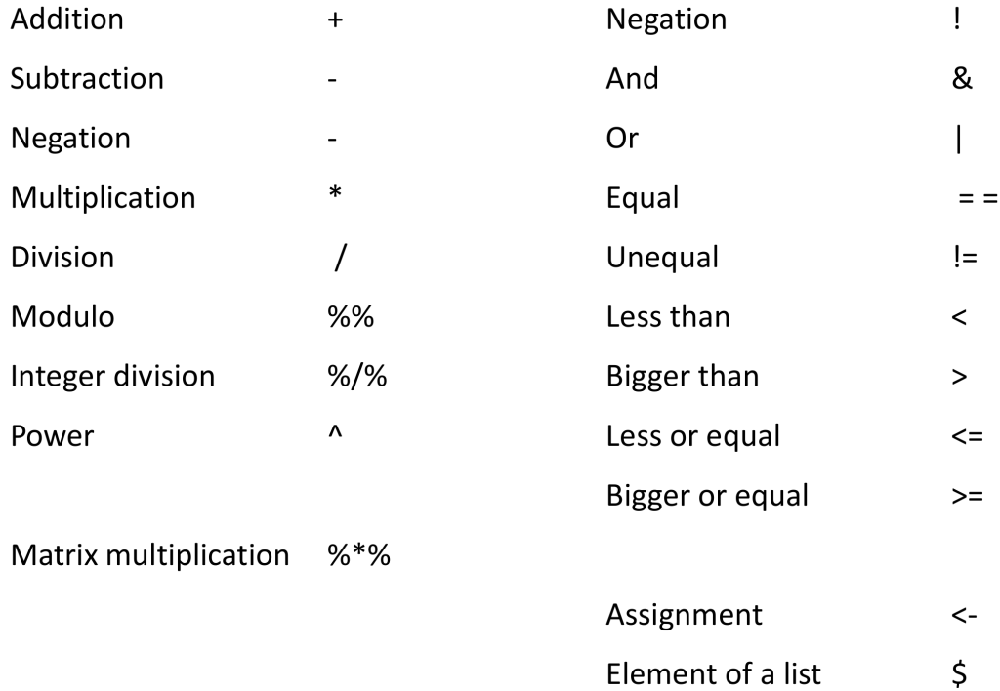
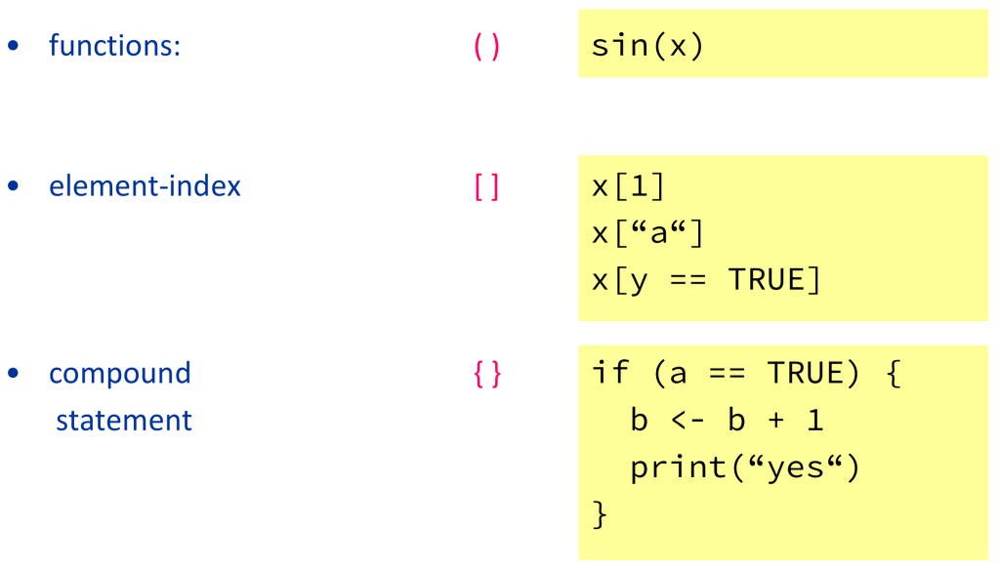
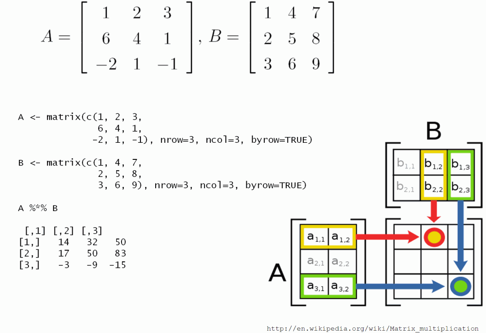
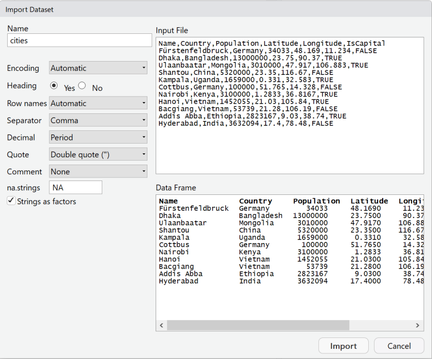
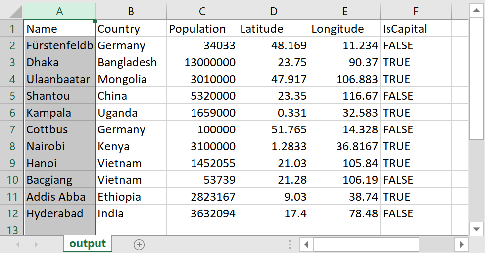

<script type="text/javascript" src="https://cdn.mathjax.org/mathjax/latest/MathJax.js?config=TeX-AMS-MML_HTMLorMML">
</script>


Some Basics of the R Language
========================================================
author: tpetzoldt
date: 2022-11-08
width: 1024
height: 768
font-family: Open Sans
css: Graphics.css


Prerequisites
========================================================

1. Install R 4.x from the [CRAN](https://cran.r-project.org) server,<br>
   e.g. https://cloud.r-project.org/
2. Install a recent version of RStudio from<br>
   https://rstudio.com/products/rstudio/download/#download

**Note:** Install **R** first and **RStudio** second

R and RStudio are available for Linux, Windows and MacOS

Outline
========================================================

Goal: Basic intuitive experience with R

1. Expressions and assignments
2. Elements of the R language
3. Data objects: vectors, matrices, algebra
4. Data import
5. Lists
6. Loops and conditional execution
7. Further reading


R is more convenient with RStudio
========================================================


R and RStudio
========================================================

#### Note

* The main engine for computations and graphics is **R**.
* **Rstudio** is a powerful IDE (integrated development environment) that embeds **R** and provides additional facilities.

#### Citation

If you need to cite the software, then first cite **R** and optionally **RStudio**.

R Core Team (2022). R: A language and environment for statistical computing. R Foundation for Statistical
Computing, Vienna, Austria. URL https://www.R-project.org/.

RStudio Team (2022). RStudio: Integrated Development Environment for R. RStudio, PBC, Boston, MA URL
http://www.rstudio.com/.


Expressions and Assignments
========================================================

Expression


```r
1 - pi + exp(1.7)
```

```
[1] 3.332355
```

- result is printed to the screen
- the [1] indicates that the value shown at the beginning of the line is the first (and here the only) element

***

Assignment

```r
a <- 1 - pi + exp(1.7)
```

- The expression on the left hand side is assigned to the variable on the right.
- The arrow is spelled as
  "a gets ..."
- To avoid confusion: use `<--` for assignment and let `=` for parameter matching
Assignments
========================================================

* Assignment of constants and a variable to a variable

```r
x <- 1.3      # numeric constant
y <- "hello"  # character constant
a <- x        # a and x both variables
```

* Assignment in opposite direction (rarely used)

```r
x -> b
```


* multiple assignment

```r
x <- a <- b
```


* Equal sign works similar to `<-` but is less powerful.

```r
x = a
```

* Super Assignment (for programmers and special cases only)

```r
x <<- 2
```


The elements of the R language
========================================================
type:prompt

A short classification of R's language elemnts:

- objects
- constants
- variables
- operators
- functions


Objects, constants, variables
========================================================

* Everything stored in R's memory is an **object**. Objects are specialized data
structures that can be simple or very complex.
* Objects can be constants or variables.

**constants**: 1, 123, 5.6, 5e7, "hello"

**variables**: can change their value are referenced by variable names (symbols)


```r
x <- 2 # x is a variable, 2 a constant
```


A syntactically valid variable name consists of:

- letters, numbers and the dot or underline characters
- starts with a letter or the dot
- if starting with the dot, not followed by a number

Special characters, except _ and . (underscore and dot) are not allowed.

International characters (e.g German umlauts &auml;, &ouml;, &uuml;, ...) are possible, but not recommended.


Allowed and disallowed identifiers
========================================================

correct:
- x, y, X, x1, i, j, k,
- value, test, myVariableName, do_something,
- .hidden, .x1

forbidden:
- 1x, .1x (starts with a number)
- !, @, \$, #, space, comma, semicolon and other special characters

reserved words cannot be used as variable names:
- if, else, repeat, while, function, for, in, next, break
- TRUE, FALSE, NULL, Inf, NaN, NA, NA\_integer\_, NA\_real\_, NA\_complex\_, NA\_character\_,
- ..., ..1, ..2

**Note:** R is case sensitive, `x` and `X`, `value` and `Value` are different.

Operators
========================================================



... and more

Functions
========================================================

Pre-defined functions:
- have a return value or a side effect
- examples with return value: `sin(x)`, `log(x)`
- examples side effect: `plot(x)`, `print(x)`
- both return value and side efect: `hist(x)`

Arguments: mandatory or optional, un-named or named
- `plot(1:4, c(3, 4, 3, 6), type = "l", col = "red")`
- if named argument matching is used (with the "=" sign), then argument order does not matter

User-defined functions:
- can be used to extend R
- will be discussed later

Functions have always a name that is followed by arguments in round parentheses.

Parentheses
========================================================




Data objects
========================================================
type: prompt

**R** supports different classes of data objects:

* Data objects can contain single values, vectors, matrices, tables, numbers, ...
* text and even maps, sound, images or video sequences.

We start with vectors, matrices and arrays, and data frames.


Vectors, matrices and arrays
========================================================

- vectors = 1D, matrices = 2D and arrays = n-dimensional
- data are arranged into rows, columns, layers, etc.
- data filled in column-wise, but structure can always be changed


```r
x <- 1:20
x
```

```
 [1]  1  2  3  4  5  6  7  8  9 10 11 12 13 14 15 16 17 18 19 20
```

```r
y <- matrix(x, nrow = 5, ncol = 4)
y
```

```
     [,1] [,2] [,3] [,4]
[1,]    1    6   11   16
[2,]    2    7   12   17
[3,]    3    8   13   18
[4,]    4    9   14   19
[5,]    5   10   15   20
```

```r
as.vector(y) # flattens the matrix to a vector
```

```
 [1]  1  2  3  4  5  6  7  8  9 10 11 12 13 14 15 16 17 18 19 20
```


Vectors, matrices and arrays II
========================================================

- **recycling rule** if the number of elements is too small


```r
x <- matrix(0, nrow=5, ncol=4)
x
```

```
     [,1] [,2] [,3] [,4]
[1,]    0    0    0    0
[2,]    0    0    0    0
[3,]    0    0    0    0
[4,]    0    0    0    0
[5,]    0    0    0    0
```

```r
x <- matrix(1:4, nrow=5, ncol=4)
x
```

```
     [,1] [,2] [,3] [,4]
[1,]    1    2    3    4
[2,]    2    3    4    1
[3,]    3    4    1    2
[4,]    4    1    2    3
[5,]    1    2    3    4
```

***


- **row-wise** creation of a matrix

```r
x <- matrix(1:20, nrow = 5, ncol = 4, byrow = TRUE)
x
```

```
     [,1] [,2] [,3] [,4]
[1,]    1    2    3    4
[2,]    5    6    7    8
[3,]    9   10   11   12
[4,]   13   14   15   16
[5,]   17   18   19   20
```

- **transpose** of a matrix

```r
x <- t(x)
x
```

```
     [,1] [,2] [,3] [,4] [,5]
[1,]    1    5    9   13   17
[2,]    2    6   10   14   18
[3,]    3    7   11   15   19
[4,]    4    8   12   16   20
```

Accessing array elements
========================================================

- a three dimensional **array**
- row, column, layer/page
- sub-matrices (slices)


```r
x <- array(1:24, dim=c(3, 4, 2))
x
```

```
, , 1

     [,1] [,2] [,3] [,4]
[1,]    1    4    7   10
[2,]    2    5    8   11
[3,]    3    6    9   12

, , 2

     [,1] [,2] [,3] [,4]
[1,]   13   16   19   22
[2,]   14   17   20   23
[3,]   15   18   21   24
```

***

- **elements** of a matrix or array


```r
x[1, 3, 1] # single element
```

```
[1] 7
```

```r
x[ , 3, 1] # 3rd column of 1st layer
```

```
[1] 7 8 9
```

```r
x[ ,  , 2] # second layer
```

```
     [,1] [,2] [,3] [,4]
[1,]   13   16   19   22
[2,]   14   17   20   23
[3,]   15   18   21   24
```

```r
x[1,  ,  ] # another slice
```

```
     [,1] [,2]
[1,]    1   13
[2,]    4   16
[3,]    7   19
[4,]   10   22
```

Reordering and indirect indexing
========================================================

Original matrix


```r
(x <- matrix(1:20, nrow = 4))
```

```
     [,1] [,2] [,3] [,4] [,5]
[1,]    1    5    9   13   17
[2,]    2    6   10   14   18
[3,]    3    7   11   15   19
[4,]    4    8   12   16   20
```

Inverted row order

```r
x[4:1, ]
```

```
     [,1] [,2] [,3] [,4] [,5]
[1,]    4    8   12   16   20
[2,]    3    7   11   15   19
[3,]    2    6   10   14   18
[4,]    1    5    9   13   17
```

***

Indirect index

```r
x[c(1, 2, 1, 2), c(1, 3, 2, 5, 4)]
```

```
     [,1] [,2] [,3] [,4] [,5]
[1,]    1    9    5   17   13
[2,]    2   10    6   18   14
[3,]    1    9    5   17   13
[4,]    2   10    6   18   14
```

Logical selection

```r
x[c(FALSE, TRUE, FALSE, TRUE), ]
```

```
     [,1] [,2] [,3] [,4] [,5]
[1,]    2    6   10   14   18
[2,]    4    8   12   16   20
```

Surprise?

```r
x[c(0, 1, 0, 1), ]
```

```
     [,1] [,2] [,3] [,4] [,5]
[1,]    1    5    9   13   17
[2,]    1    5    9   13   17
```

Matrix algebra
========================================================

Matrix


```r
(x <- matrix(1:4,   nrow = 2))
```

```
     [,1] [,2]
[1,]    1    3
[2,]    2    4
```

Diagonal matrix

```r
(y <- diag(2))
```

```
     [,1] [,2]
[1,]    1    0
[2,]    0    1
```


Element wise addition and multiplication

```r
x * (y + 1)
```

```
     [,1] [,2]
[1,]    2    3
[2,]    2    8
```

***

Outer product (and sum)


```r
1:4 %o% 1:4
```

```
     [,1] [,2] [,3] [,4]
[1,]    1    2    3    4
[2,]    2    4    6    8
[3,]    3    6    9   12
[4,]    4    8   12   16
```

```r
outer(1:4, 1:4, FUN = "+")
```

```
     [,1] [,2] [,3] [,4]
[1,]    2    3    4    5
[2,]    3    4    5    6
[3,]    4    5    6    7
[4,]    5    6    7    8
```

Matrix multiplication


```r
x %*% y
```

```
     [,1] [,2]
[1,]    1    3
[2,]    2    4
```

Matrix multiplication in detail
========================================================



Transpose and inverse
========================================================

Matrix

```r
x <- matrix(c(1, 2, 3, 4, 3, 2, 5, 4, 6),
            nrow = 3)
x
```

```
     [,1] [,2] [,3]
[1,]    1    4    5
[2,]    2    3    4
[3,]    3    2    6
```

Transpose

```r
t(x)
```

```
     [,1] [,2] [,3]
[1,]    1    2    3
[2,]    4    3    2
[3,]    5    4    6
```

***

Inverse ($x^{-1}$)

```r
solve(x)
```


```
        [,1]    [,2]    [,3]
[1,] -0.6667  0.9333 -0.0667
[2,]  0.0000  0.6000 -0.4000
[3,]  0.3333 -0.6667  0.3333
```

$x \cdot x^{-1}$


```r
x %*% solve(x)
```

```
     [,1] [,2] [,3]
[1,]    1    0    0
[2,]    0    1    0
[3,]    0    0    1
```


Linear system of equations
========================================================

$$
\begin{aligned}
 3x && +  && 2y   && -  && z  && =  && 1 \\
 2x && -  && 2y   && +  && 4z && =  && -2 \\
 -x && +  && 1/2y && -  && z  && =  && 0
\end{aligned}
$$


```r
A <- matrix(c(3,  2,   -1,
             2,  -2,    4,
            -1,   0.5, -1), nrow=3, byrow=TRUE)
b <- c(1, -2, 0)
```

$$
\begin{aligned}
Ax &= b\\
x  &= A^{-1}b
\end{aligned}
$$


```r
solve(A) %*% b
```

```
     [,1]
[1,]    1
[2,]   -2
[3,]   -2
```

Data frames and data import
========================================================
type: prompt


Data frames
========================================================

* represents tabular data
* similar to matrices, but rows are allowed to contain different types of data in their **columns**
* typically imported from a file with `read.table` or `read.csv`


```r
cities <- read.csv("data/cities.csv")
cities
```

```
                  Name    Country Population Latitude Longitude IsCapital
1  F\xfcrstenfeldbruck    Germany      34033  48.1690   11.2340     FALSE
2                Dhaka Bangladesh   13000000  23.7500   90.3700      TRUE
3          Ulaanbaatar   Mongolia    3010000  47.9170  106.8830      TRUE
4              Shantou      China    5320000  23.3500  116.6700     FALSE
5              Kampala     Uganda    1659000   0.3310   32.5830      TRUE
6              Cottbus    Germany     100000  51.7650   14.3280     FALSE
7              Nairobi      Kenya    3100000   1.2833   36.8167      TRUE
8                Hanoi    Vietnam    1452055  21.0300  105.8400      TRUE
9             Bacgiang    Vietnam      53739  21.2800  106.1900     FALSE
10          Addis Abba   Ethiopia    2823167   9.0300   38.7400      TRUE
11           Hyderabad      India    3632094  17.4000   78.4800     FALSE
```

What is a CSV file?
========================================================

<small>
* comma separated values.
* first line contains column names
* decimal is `dec="."`, column separator is `sep=","`
</small>

**Problems**
<small>
* some countries use `dec=","` and `sep=";"`
* Excel may export mixed style with `dec="."` and `sep=";"`
* Some start with comments that need to be `skip`ped.
</small>

**Example CSV file**

```
Name,Country,Population,Latitude,Longitude
Dhaka,Bangladesh,13000000,23.75,90.37
Ulaanbaatar,Mongolia,3010000,47.917,106.883
Shantou,China,5320000,23.35,116.67
Kampala,Uganda,1659000,0.331,32.583
Cottbus,Germany,100000,51.765,14.328
Nairobi,Kenya,3100000,1.2833,36.8167
Hanoi,Vietnam,1452055,21.03,105.84
Addis Abba,Ethiopia,2823167,9.03,38.74
Hyderabad,India,3632094,17.4,78.48
```

The population was taken from Wikipedia some years ago.


Different read-Funktions
========================================================

To make life easier, different `read`-Functions were created. Some are more flexible,
some more automatic, some faster, some more robust ...

To avoid confusion, we use only the following:

**Base R**

* `read.table()`: this is the most flexible standard function, see help file for details
* `read.csv()`: default options for standard csv files (with `dec="."` and `sep=`,)

**Tidyverse readr-package**

* `read_delim()`: similar to `read.table()` but more modern, automatic and faster
* `read_csv()`: similar to `read.csv()` with more automatism, e.g. date detection


Recommendation
========================================================

Most of our course examples are plain CSV files, so we can use `read.csv()` or `read_csv()`.


```r
library("readr")
cities <- read_csv("data/cities.csv")
cities
```

```
# A tibble: 11 × 6
   Name                  Country    Population Latitude Longitude IsCapital
   <chr>                 <chr>           <dbl>    <dbl>     <dbl> <lgl>    
 1 "F\xfcrstenfeldbruck" Germany         34033   48.2        11.2 FALSE    
 2 "Dhaka"               Bangladesh   13000000   23.8        90.4 TRUE     
 3 "Ulaanbaatar"         Mongolia      3010000   47.9       107.  TRUE     
 4 "Shantou"             China         5320000   23.4       117.  FALSE    
 5 "Kampala"             Uganda        1659000    0.331      32.6 TRUE     
 6 "Cottbus"             Germany        100000   51.8        14.3 FALSE    
 7 "Nairobi"             Kenya         3100000    1.28       36.8 TRUE     
 8 "Hanoi"               Vietnam       1452055   21.0       106.  TRUE     
 9 "Bacgiang"            Vietnam         53739   21.3       106.  FALSE    
10 "Addis Abba"          Ethiopia      2823167    9.03       38.7 TRUE     
11 "Hyderabad"           India         3632094   17.4        78.5 FALSE    
```


Data import assistant
========================================================

File --> Import Dataset

Several options are available:

* "From text (base)" uses the classical R functions
* "From text (readr)" is more modern and uses an add-on package
* "From Excel" can read Excel files if (and only if) they have a clear tabular structure


From text (base)
========================================================



From text (readr)
========================================================


Save data in an Excel-compatible text format
========================================================




English number format (**.** as decimal):

```r
write.table(cities, "output.csv", row.names = FALSE, sep=",")
```

German number format (**,** as decimal):

```r
write.table(cities, "output.csv", row.names = FALSE, sep=";", dec=",")
```

Lists
========================================================
type: prompt

Lists
========================================================

* most flexible data type in R
* allows tree-like  structure

Creation of lists


```r
L1 <- list(a=1:10, b=c(1,2,3), x="hello")
```

* lists within lists
* `str` shows tree-like structure:


```r
L2 <- list(a=5:7, b=L1)
str(L2)
```

```
List of 2
 $ a: int [1:3] 5 6 7
 $ b:List of 3
  ..$ a: int [1:10] 1 2 3 4 5 6 7 8 9 10
  ..$ b: num [1:3] 1 2 3
  ..$ x: chr "hello"
```

***

Access to list elements by names

```r
L2$a
```

```
[1] 5 6 7
```

```r
L2$b$a
```

```
 [1]  1  2  3  4  5  6  7  8  9 10
```

or with indices

```r
L2[1]   # a list with 1 element
```

```
$a
[1] 5 6 7
```

```r
L2[[1]] # content of 1st element
```

```
[1] 5 6 7
```

Lists II
========================================================

Convert list to vector

```r
unlist(L2)
```

```
     a1      a2      a3    b.a1    b.a2    b.a3    b.a4    b.a5    b.a6    b.a7 
    "5"     "6"     "7"     "1"     "2"     "3"     "4"     "5"     "6"     "7" 
   b.a8    b.a9   b.a10    b.b1    b.b2    b.b3     b.x 
    "8"     "9"    "10"     "1"     "2"     "3" "hello" 
```

```r
str(unlist(L2))
```

```
 Named chr [1:17] "5" "6" "7" "1" "2" "3" "4" "5" "6" "7" "8" "9" "10" "1" ...
 - attr(*, "names")= chr [1:17] "a1" "a2" "a3" "b.a1" ...
```

Flatten list (remove only top level of list)

```r
str(unlist(L2, recursive = FALSE))
```

```
List of 6
 $ a1 : int 5
 $ a2 : int 6
 $ a3 : int 7
 $ b.a: int [1:10] 1 2 3 4 5 6 7 8 9 10
 $ b.b: num [1:3] 1 2 3
 $ b.x: chr "hello"
```


Lists, vectors and data frames
========================================================

Convert vector to list

```r
x <- 1:3
str(as.list(x))
```

```
List of 3
 $ : int 1
 $ : int 2
 $ : int 3
```

Convert matrix to data frame

```r
x <- matrix(1:16, nrow=4)
df <- as.data.frame(x)
is.list(df)
```

```
[1] TRUE
```

```r
df
```

```
  V1 V2 V3 V4
1  1  5  9 13
2  2  6 10 14
3  3  7 11 15
4  4  8 12 16
```

***

Convert data frame to matrix

```r
as.matrix(df)
```

```
     V1 V2 V3 V4
[1,]  1  5  9 13
[2,]  2  6 10 14
[3,]  3  7 11 15
[4,]  4  8 12 16
```

Append column to data frame

```r
df2 <- cbind(df, id=c("first", "second", "third", "fourth"))
```

Data frame with character column

```r
as.matrix(df2)
```

```
     V1  V2  V3   V4   id      
[1,] "1" "5" " 9" "13" "first" 
[2,] "2" "6" "10" "14" "second"
[3,] "3" "7" "11" "15" "third" 
[4,] "4" "8" "12" "16" "fourth"
```


Naming of elements
========================================================

During creation


```r
x <- c(a=1.2, b=2.3, c=6)
L <- list(a=1:3, b="hello")
```

With `names`-function


```r
names(L)
```

```
[1] "a" "b"
```

```r
names(L) <- c("numbers", "text")
names(L)
```

```
[1] "numbers" "text"   
```


```r
x <- 1:5
names(x) <- letters[1:5]
x
```

```
a b c d e 
1 2 3 4 5 
```


Select and reorder data frame columns
========================================================


```r
x <- matrix(1:16, nrow=4)
df <- as.data.frame(x)
df
```

```
  V1 V2 V3 V4
1  1  5  9 13
2  2  6 10 14
3  3  7 11 15
4  4  8 12 16
```

```r
names(df) <- c("N", "P", "O2", "C")
df
```

```
  N P O2  C
1 1 5  9 13
2 2 6 10 14
3 3 7 11 15
4 4 8 12 16
```

```r
df2 <- df[c("C", "N", "P")]
df2
```

```
   C N P
1 13 1 5
2 14 2 6
3 15 3 7
4 16 4 8
```


Apply FUN to all elements of a list
========================================================


```r
df  # data frame of previous slide
```

```
  N P O2  C
1 1 5  9 13
2 2 6 10 14
3 3 7 11 15
4 4 8 12 16
```

```r
lapply(df, mean)  # returns list
```

```
$N
[1] 2.5

$P
[1] 6.5

$O2
[1] 10.5

$C
[1] 14.5
```

```r
sapply(df, mean)  # returns vector
```

```
   N    P   O2    C 
 2.5  6.5 10.5 14.5 
```

***

Row wise apply

```r
apply(df, MARGIN = 1, sum)
```

```
[1] 28 32 36 40
```

Column wise apply

```r
apply(df, MARGIN = 2, sum)
```

```
 N  P O2  C 
10 26 42 58 
```

Apply user defined function

```r
se <- function(x)
  sd(x)/sqrt(length(x))

sapply(df, se)
```


```
     N      P     O2      C 
0.6455 0.6455 0.6455 0.6455 
```


Loops and conditional execution
========================================================
type: prompt

Loops
========================================================


```r
for (i in 1:4) {
  cat(i, 2*i, "\n")
}
```

```
1 2 
2 4 
3 6 
4 8 
```


```r
j <- 1; x <- 0
while (j > 1e-3) {
  j <- 0.1 * j
  x <- x + j
  cat(j, x, "\n")
}
```

```
0.1 0.1 
0.01 0.11 
0.001 0.111 
1e-04 0.1111 
```

In many cases, loops can be avoided by using vectors and matrices or `apply`.

***


```r
x <- 1
repeat {
 x <- 0.1*x
 cat(x, "\n")
 if (x < 1e-4) break
}
```

```
0.1 
0.01 
0.001 
1e-04 
1e-05 
```


```r
for (i in 1:3) {
  for (j in c(1,3,5)) {
    cat(i, i*j, "\n")
  }
}
```

```
1 1 
1 3 
1 5 
2 2 
2 6 
2 10 
3 3 
3 9 
3 15 
```


Avoidable loops
========================================================

Column means of a data frame

```r
## a data frame
df <- data.frame(
  N=1:4, P=5:8, O2=9:12, C=13:16
)

## loop
m <- numeric(4)
for(i in 1:4) {
 m[i] <- mean(df[,i])
}
m
```

```
[1]  2.5  6.5 10.5 14.5
```

* easier without loop

```r
sapply(df, mean)
```

```
   N    P   O2    C 
 2.5  6.5 10.5 14.5 
```

... also possible `colMeans`

***
An infinite series:

$$
\sum_{k=1}^{\infty}\frac{(-1)^{k-1}}{2k-1} = 1 - \frac{1}{3} + \frac{1}{5} - \frac{1}{7}
$$


```r
x <- 0
for (k in seq(1, 1e5)) {
  enum  <- (-1)^(k-1)
  denom <- 2*k-1
  x <- x + enum/denom
}
4 * x
```

```
[1] 3.141583
```

$\Rightarrow$ Can you vectorize this?

Neccessary loop
========================================================

The same series:

$$
\sum_{k=1}^{\infty}\frac{(-1)^{k-1}}{2k-1} = 1 - \frac{1}{3} + \frac{1}{5} - \frac{1}{7}
$$


```r
x <- 0
k <- 0
repeat {
  k <- k + 1
  enum  <- (-1)^(k-1)
  denom <- 2*k-1
  delta <- enum/denom
  x <- x + delta
  if (abs(delta) < 1e-6) break
}
4 * x
```

```
[1] 3.141595
```

* number of iterations not known in advance
* convergence criterium, stop when required precision is reached
* no allocation of long vectors --> less memory than for loop

<small>Note: there are more efficient methods to calculate $\pi$.</small>


if-clause
========================================================

The example before showed already an `if`-clause. The syntax is as follows:


```r
if (<condition>)
  <statement>
else if (<condition>)
  <statement>
else
  <statement>
```

* Proper indentation improves readability. Suggestion 2: characters.
* Professionals indent always.
* Please do!

***

* `statement` can of course be a compound statement with curly brackets `{}`
* to be on the safe side and to avoid common errors you may always use `{}`.

Example:

```r
if (x == 0) {
  print("x is Null")
} else if (x < 0) {
  print("x is negative")
} else {
  print("x is positive")
}
```

Vectorized if
========================================================

Very often, a vectorized `ifelse` is more appropropriate than an `if`-function.

Let's assume we have a data set of chemical measurements `x` with missing `NA` values,
and "nondetects" that are encoded with `-99`. First we want to replace the nontetects
with half of the detection limit (e.g. 0.5):


```r
x <- c(3, 6, NA, 5, 4, -99, 7, NA,  8, -99, -99, 9)
x2 <- ifelse(x == -99, 0.5, x)
x2
```

```
 [1] 3.0 6.0  NA 5.0 4.0 0.5 7.0  NA 8.0 0.5 0.5 9.0
```

Now let's remove the `NA`s:


```r
na.omit(x2)
```

```
 [1] 3.0 6.0 5.0 4.0 0.5 7.0 8.0 0.5 0.5 9.0
attr(,"na.action")
[1] 3 8
attr(,"class")
[1] "omit"
```

This returns a special object, that can be used like a normal vector.


Further Reading
===============

Explore some examples yourselv with [An introductory R session](https://tpetzoldt.github.io/RBasics/An-Introductory-R-Session.html)

Follow-up presentations:

* [Functions everywhere](Functions.html)
* [Graphics in R](Graphics.html)
* [Pipelines in R](https://tpetzoldt.github.io/RToolbox/pipes-intro)

More details in the official R manuals, especially in [**An Introduction to R**](https://cran.r-project.org/doc/manuals/r-release/R-intro.html)

Many videos can be found on [Youtube](https://www.youtube.com), on [Rstudio](https://rstudio.com/resources/webinars/) and somewhere else

This tutorial was made with R-Presentations of [RStudio](https://www.rstudio.org)

Author: tpetzoldt +++
[Homepage](https://www.tu-dresden.de/Members/thomas.petzoldt) +++
[Github page](https://tpetzoldt.github.io)


