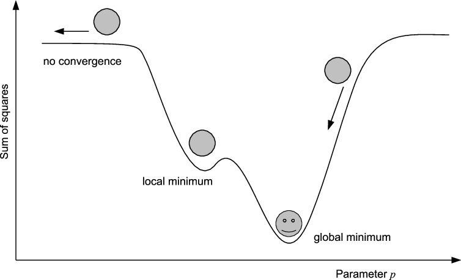
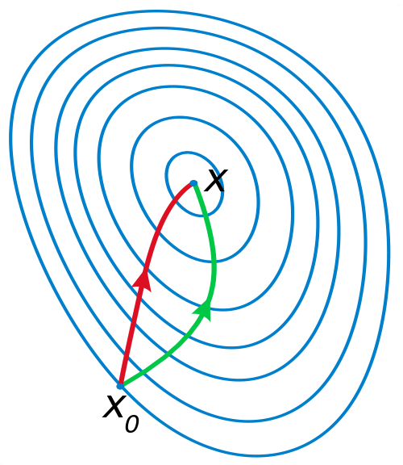

class: center, middle, title-slide

background-image: url("img/water_tud_r_oer_by.png")

background-size: cover


<!-- Own title slide / -->

# A small intro to nonlinear regression with **R**

#### Thomas Petzoldt

.small[Version `r Sys.Date()`, Source code available on https://github.com/tpetzoldt]


--- 

Use cursor keys for navigation, press .red["O"] for a slide .red[O]verview

<!--
Verbatim code embedding:
https://themockup.blog/posts/2021-08-27-displaying-verbatim-code-chunks-in-xaringan-presentations/
-->

<!--- Setup ------------------------------------------------------------------->
```{r setup, include=FALSE}
knitr::opts_chunk$set(echo = FALSE, fig.width=14, 
                      fig.height=6, dev.args = list(pointsize=20))
#library("dplyr")
#library("tidyr")
library("kableExtra")
#library("DiagrammeR")
mypar <- list(las = 1, cex.lab = 1.4, cex.axis=1.4, lwd = 2)
```

```{r xaringan-themer, include=FALSE, warning=FALSE}
library("xaringanthemer")
style_mono_light(
  title_slide_text_color = "#00305d",
  link_color = "#006ab2"#,
  #white_color = "#FFFFFF"
)
```

```{r xaringanExtra, include=FALSE, warnint=FALSE}
# devtools::install_github("gadenbuie/xaringanExtra")
#library("xaringanExtra")
xaringanExtra::use_webcam()
xaringanExtra::use_tile_view()
#xaringanExtra::use_scribble()
#xaringanExtra::use_freezeframe()
#xaringanExtra::use_progress_bar(color = "#0051BA", location = "top")
```

<!-- citations work differently with xaringan compared to @Markdown / -->
```{r, load_refs, include=FALSE, cache=FALSE}
library("RefManageR")
BibOptions(check.entries = FALSE,
           bib.style = "authoryear",
           cite.style = "authoryear",
           style = "markdown",
           dashed = FALSE)
bib <- ReadBib("./bib-nonlinear.bib", check = FALSE)
```
<!--- End of Setup ------------------------------------------------------------>


<style>.bigfont {
  font-size: 140%;
  line-height: 160%;
}</style>

<style>.bigcode {
  font-size: 140%;
  line-height: 140%;
}</style>


---

## Nonlinear regression

Many phenomena in nature are non-linear!

**Linear or non-linear?**

* Some non-linear problems can be solved with linear methods
* e.g., polynomials or periodic (sine and cosine) functions
* others can be fitted by using transformations

**Example**

$$y = a \cdot x^b$$
can be transformed to:
$$\ln(y) = \ln(a) + b \cdot \ln(x)$$

* but: linearization transforms also the residuals
* transformation is sometimes correct and sometimes wrong
* homogeneity of variances

---

## Linearization or direct nonlinear fitting?

### Linearising transformations

* log, square root, reciprocals ...
* can be applied if the residual variance remains (or is becoming) homogenous.
* but in some cases: transformations lead to heteroscedasticity<br>
  $\Rightarrow$ **biased** regression parameters.

### Nonlinear regression

* very flexible, user-defined functions,
* no transformation required
* but: requires **iterative** optimization methods,
* in theory only local optima can be found,
* parameters are not in all cases **identifiable**.

---

## Nonlinear regression
### Iterative search for the minimum of the sum of squares


---
## How to find the global minimum?

In all cases where an analytical solution of the partial derivatives
is unknown or not existent or if linearization leads to a
violation of the regression assumptions, a numerical optimization
method has to be used.

#### Goodness of fit

The quality of the fit can be measured by the sum of least squares $SQ$:

$$
SQ = \sum_{i=1}^n\left(y_i- f(\mathbf x_i, \mathbf p)\right)^2 = \min !
$$

with $y$: dependent variable, $\mathbf x$: matrix of independent variables,
$\mathbf p$: parameter vector, $n$: sample size.

The nonlinear coefficient of determination $R^2$ can be calculated from the
variance of the residuals $\varepsilon$, compared to the variance of the original data $y$:

$$
R^2 = 1 - \frac{\text{variance of the residuals}}{\text{variance of the y-data}} = 1- \frac{s^2_\varepsilon}{s^2_y}
$$
---

## General principle of algorithms

.bigfont[
The minimum of the squared residuals (SQ) is searched by iteration:

1. Start from an initial guess for the parameter set.
2. Try to find a parameter set with lower SQ.
3. Is the new parameter set better?
    * No: Reject the new parameters and goto 2
    * Yes: Accept the new parameters and goto 4
4. Is the new parameter set good enough?
    * No: goto 2
    * Yes: goto 5
5. Parameter set found.
]
---
## Deterministic Methods

### Gradient Search

* go one step into the direction of steepest descent
* $\rightarrow$ relatively simple
* $\rightarrow$ relatively robust for "more complicated'' problems


### Newton's Method

* quadratic approximation of the SQ function
* try to estimate the minimum
* $\rightarrow$ takes curvature into account
* $\rightarrow$ faster for "well behaving" problems
* several versions: quasi-Newton, Gauss-Newton, L-BFGS, ...


**Levenberg-Marquardt** interpolates between Gauss-Newton and gradient descent.

---

## Newton vs. Gradient Search



Newton method (red) uses curvature information to converge faster than gradient descent (green).

See also https://en.wikipedia.org/wiki/Newton's_method_in_optimization


---

## Stochastic Methods

Use statistical principles (random search)

**Classical methods**

* Simulated annealing: simulates heating and cooling of matter $\rightarrow$ "Crystallisation process".
* Controlled random search  `r Citep(bib, c("Price1977", "Price1983"))`


**Evolutionary Algorithms**

* analogy to genetics: mutation and selection
* follows a "population" of several parameter sets in parallel
* information exchange ("crossover") between parameter sets
* $\rightarrow$ for complicated problems with large number of parameters
* nowadays builtin in Microsoft Excel and LibreOffice Calc

... and many more.

---
## Examples

.bigfont[
* Enzyme kinetics
* Growth of organisms
* Calibration of complex models in chemistry, hydrology, hydrophysics, groundwater, wastewater, water quality ... finance, business and social sciences.
]

---
## Enzyme Kinetics

... can be described with the well-known Michaelis-Menten function:

```{r enzymekinetics, height=6,width=10}
S <-c(25, 25, 10, 10, 5, 5, 2.5, 2.5, 1.25, 1.25)
V <-c(0.0998, 0.0948, 0.076, 0.0724, 0.0557, 
      0.0575, 0.0399, 0.0381, 0.017, 0.0253)
model_fit<-nls(V ~ SSmicmen(S, Vm, K))

par(mfrow=c(1,2), las=1, lwd=2)
## Lineweaver-Burk
x <- 1/S; y <- 1/V

plot(x, y, xlab="1/S", ylab="1/V", xlim=c(-0.2,1), ylim=c(0, 80), pch=16,
  main="Linearisation\n(Lineweaver-Burk)")
abline(h=0, lwd=1, col="grey")
abline(v=0, lwd=1, col="grey")
m <- lm(y ~ x)
abline(m, col = "red")
Vm_l <- 1/coef(m)[1]
Km_l <- coef(m)[2] * Vm_l
#legend("topleft", c("vmax = 1/intercept", "km = slope * vmax"), 
#        box.lwd=1, bg="white")
text(0.35, 75, "1/V = 1/vmax + km / vmax * S")

## retransformed, both together
plot(S, V, xlim = c(0, max(S)),ylim=c(0, max(V)), pch=16, main="No Transformation")
x1 <-seq(0, 25, length=100)
lines(x1, Vm_l * x1 / (Km_l + x1), col="red")
lines(x1, predict(model_fit, data.frame(S=x1)), col="blue")
legend("bottomright", legend=c("linearisation", "nonlinear"), 
       box.lwd=1, lwd=2, col=c("red", "blue"))
text(15, 0.04, "V = S * vmax / (km + S)")
```

---

## Linearization vs. (true) nonlinear regression

**Linearizing transformation**

[>] Appropriate if transformation improves homogeneity of variances <br>
[+] Fast, simple and easy.<br>
[+] Analytical solution returns the global optimum.<br>
[-] Only a limited set of functions can be fitted.<br>
[-] Can lead to wrongly transformed error structure and biased results.


**Nonlinear Regression**

[>] Appropriate if error structure is already homogeneous and/or analytical solution does not exist.<br>
[+] Can be used to fit arbitrary functions, given that the parameters are identifiable.<br>
[-] Needs start values and considerable computation time.<br>
[-] Best solution (global optimum) is not guaranteed.


---
## Nonlinear regression: simple exponential
.bigcode[
```{r nlregexp, echo=TRUE, eval = FALSE}
x <- 1:10
y <- c(1.6, 1.8, 2.1, 2.8, 3.5, 4.1, 5.1, 5.8, 7.1, 9.0)
plot(x, y)
pstart <- c(a = 1, b = 1)
model_fit <- nls(y ~ a * exp(b * x), start = pstart)

x1 <- seq(1, 10, 0.1)
y1 <- predict(model_fit, data.frame(x = x1))
lines(x1, y1, col = "red")

summary(model_fit)
```
]

```{r nlregexp}
```

```{r echo=TRUE}
(Rsquared <- 1 - var(residuals(model_fit))/var(y))
```

---
## Michaelis-Menten-Kinetics

### Code

.bigcode[
```{r mmenten, echo=TRUE, eval = FALSE}
S <-c(25, 25, 10, 10, 5, 5, 2.5, 2.5, 1.25, 1.25)
V <-c(0.0998, 0.0948, 0.076, 0.0724, 0.0557,
      0.0575, 0.0399, 0.0381, 0.017, 0.0253)

## Michaelis-Menten kinetics
f <- function(S, Vm, K) { Vm * S/(K + S) }

pstart <- c(Vm = 0.1, K = 5)
model_fit <- nls(V ~ f(S, Vm, K), start = pstart)
summary(model_fit)

(1 - var(residuals(model_fit))/var(V)) # nonlinear r²
plot(S, V, xlim = c(0, max(S)), ylim = c(0, max(V)))
x1 <-seq(0, 25, length = 100)
lines(x1, predict(model_fit, data.frame(S = x1)), col = "red")
```
]

### Results

```{r mmenten}
```


---
## Michaelis-Menten-Kinetics with selfstart

* Function `SSmicmen` determines start parameters automatically.
* Only few selfstart functions available in R

### Code

.bigcode[
```{r mmselfstart, echo=TRUE, eval = FALSE}
S <- c(25, 25, 10, 10, 5, 5, 2.5, 2.5, 1.25, 1.25)
V <- c(0.0998, 0.0948, 0.076, 0.0724, 0.0557,
       0.0575, 0.0399, 0.0381, 0.017, 0.0253)

model_fit <- nls(V ~ SSmicmen(S, Vm, K))
summary(model_fit)

plot(S, V, xlim = c(0, max(S)), ylim = c(0, max(V)))
x1 <-seq(0, 25, length = 100)
lines(x1, predict(model_fit, data.frame(S = x1)), col="red")
```
]

### Results

```{r mmselfstart}
```

---
### Correlation of parameters

```{r echo=TRUE}
summary(model_fit, correlation=TRUE)
```

* high absolute values of correlation indicate non-identifiability of parameters
* critical value depends on the data
* sometimes, better start values or another optimization algorithm can help

---
## Practical hints

* plot data
* find good starting values by thinking about it or by trial and error
* avoid very small and/or very large numbers<br>
  $\longrightarrow$ rescale the problem to values between approx 0.001 to 1000
* start with a simple function and add terms and parameters sequentially
* Don't take significance of parameters too seriously. A non-significant parameter 
may be necessary for the structure of the model, removal of it will invalidate the whole model.


---

## Further reading

* Package **growthrates** for growth curves: https://cran.r-project.org/package=growthrates
* Package **FME** for more complex model fitting tasks (identifiability analysis, constrained optimization, multiple dependent variables and MCMC): `r Citep(bib, "FME")`, https://cran.r-project.org/package=FME 

* More about optimization in **R**: https://cran.r-project.org/web/views/Optimization.html


---


## References


```{r refs, echo=FALSE, results="asis"}
PrintBibliography(bib)
```

---
## Appendix

---

## Lineweaver-Burk transformation vs. nonlinear fit

See: https://en.wikipedia.org/wiki/Lineweaver-Burk_plot

### Code

```{r enzymekinetics, eval=FALSE, echo=TRUE}
```
