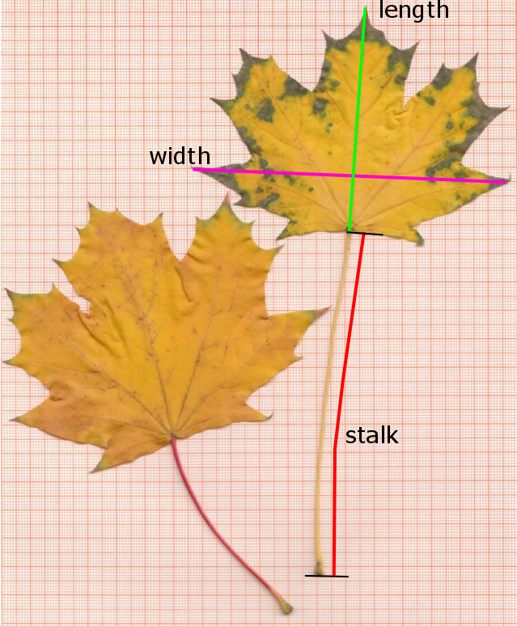

class: center, middle, title-slide

<!--
background-image: url("fig/water_tud_r_oer_by.png")
-->
background-image: url("fig/pipeline01-highkey.png")

background-size: cover


<!-- Own title slide / -->

# Pipelines in R - A Small Introduction

#### Thomas Petzoldt

.small[Version `r Sys.Date()`, source code freely available from https://github.com/tpetzoldt/tpetzoldt.github.io/)]


--- 

Use cursor keys for navigation, press .red["O"] for a slide .red[O]verview

<!--
Verbatim code embedding:
https://themockup.blog/posts/2021-08-27-displaying-verbatim-code-chunks-in-xaringan-presentations/
-->

<!--- Setup ------------------------------------------------------------------->
```{r setup, include=FALSE}
knitr::opts_chunk$set(echo = TRUE, fig.width=14, plot=TRUE,
                      fig.height=6, dev.args = list(pointsize=20))
library("dplyr")
library("tidyr")
library("lubridate")
library("kableExtra")
library("DiagrammeR")
mypar <- list(las = 1, cex.lab = 1.4, cex.axis=1.4, lwd = 2)
```

```{r xaringan-themer, include=FALSE, warning=FALSE}
library("xaringanthemer")
style_mono_light(
  title_slide_text_color = "#00305d",
  link_color = "#006ab2"#,
  #white_color = "#FFFFFF"
)
```

```{r xaringanExtra, include=FALSE, warnint=FALSE}
#library("xaringanExtra")
xaringanExtra::use_webcam()
xaringanExtra::use_tile_view()
#xaringanExtra::use_scribble()
#xaringanExtra::use_freezeframe()
#xaringanExtra::use_progress_bar(color = "#0051BA", location = "top")
```

<!-- citations work differently with xaringan compared to @Markdown / -->
```{r, load_refs, include=FALSE, cache=FALSE}
library("RefManageR")
BibOptions(check.entries = FALSE,
           bib.style = "authoryear",
           cite.style = "authoryear",
           style = "markdown",
           dashed = FALSE)
bib <- ReadBib("./bib.bib", check = FALSE)
```
<!--- End of Setup ------------------------------------------------------------>

---

## Preface

The examples contained herein require installation and loading of several R 
packages:

```{r}
library("dplyr")
library("tidyr")
library("lubridate")
library("knitr")
library("readxl")
library("ggplot2")
```

The examples were tested with **R** 4.2.1 and **RStudio** 2022.07.1.

---
## An introductory example

The data file `leaves.csv` contains two samples of Maple (*Acer platanoides*) leaves, collected and measured by two groups of students. Group **HSE** had the freedom to collect an individual leaf from a tree close to the institute, while group **HYB** got a random sample from the supervisor. The basic hypotheses was, that sampling bias may affect statistical parameters, especially mean and variance.

Download the file [leaves.csv](https://raw.githubusercontent.com/tpetzoldt/datasets/main/data/leaves.csv), save it to a working directory and then read it with
`read.csv`:


```{r eval=FALSE}
leaves <- read.csv("leaves.csv") 
```

```{r include=FALSE}
filename <- "https://raw.githubusercontent.com/tpetzoldt/datasets/main/data/leaves.csv"
leaves <- read.csv(filename) 
```

As a first step, it is always a good idea to have a look at the data:

.pull-left[
```{r}
head(leaves)
```
]
.pull-right[
  
]

---

## A boxplot

```{r}
boxplot(width ~ group, data=leaves)
```

---
## Summary statistics

```{r}
summary(leaves)
```

---
## Summary statistics per group

**Note:** If you are not interested in this "base **R**" approach, just skip this slide. The modern approach is easier.

```{r}
aggregate(cbind(length, width, stalk) ~ group, mean, data=leaves)
aggregate(cbind(length, width, stalk) ~ group, sd, data=leaves)
aggregate(cbind(length, width, stalk) ~ group, min, data=leaves)
aggregate(cbind(length, width, stalk) ~ group, max, data=leaves)
```

---
## More streamlined 

.pull-left[
Package **dplyr** contains two very handy functions:
]
.pull-right[
* `group_by`
* `summarize`
]

These functions can again be applied in a classical way of function calls, or 
with so-called pipelines, that improve readability further.

#### Classical approach 1: separate code lines

```{r, eval=FALSE}
library(dplyr)
leaves_grouped <- group_by(leaves, group)
summarize(leaves_grouped, mean=mean(width), sd=sd(width), 
                          min=min(width), max=max(width))
```

$\ominus$ needs a temporary variable: `leaves_grouped`

#### Classical approach 2: enclose in parentheses

```{r, eval=FALSE}
summarize(group_by(leaves, group), 
        mean=mean(width), sd=sd(width), min=min(width), max=max(width))
```

$\oplus$ no temporary variables necessary <br>
$\ominus$ nested parentheses


---
.pull-left[
## Pipelines
]


.pull-right[

]

In recent versions of **R** two different pipeline operators are available:

### Magrittr pipeline operator  **.red[`%>%`]**

The **.red[`%>%`]** operator was introduced by the user-contributed 
**magrittr** package `r Citep(bib, "magrittr")` and then became very popular.
It is automatically loaded by the **dplyr** package `r Citep(bib, "dplyr")`. 

### Native pipeline operator  **.red[`|>`]**

Since version **4.1.0**, **R** has now a built-in pipeline operator `|>` that 
according to the help file "is more streamlined".

It is recommended to use a recent version of **R** > 4.2 with native pipes `|>` .
But, if you still need to use an older **R** version, you can also use `%>%` 
for the examples in this document.

There are a few differences regarding so-called placeholders, that will be 
explained in future versions of the slides.


---
.pull-left[
## Application of **.red[`|>`]**
]


.pull-right[

]


#### The output from the first function is piped to the next

```{r, eval=FALSE}
group_by(leaves, group) |>
summarize(mean = mean(width), sd = sd(width), 
          min = min(width), max = max(width))
```

#### Or, even more streamlined: pipe data from start


```{r}
leaves |>
  group_by(group) |>
  summarize(mean = mean(width), sd = sd(width), 
            min = min(width), max = max(width))
```

The pipeline operator **.red[`|>`]** transfers (.red["pipes"]) the output from 
one function to the first argument of the next function.

---
### Classical functional style


```{r, eval=FALSE}
group_by(leaves, group)
```  


```{r diag-functional, echo=FALSE, fig.height=2}
grViz("digraph functional {
         graph [rankdir = 'LR', bgcolor='none']
           node [shape = box, penwidth=2, fontname = 'Helvetica']
             'input', 'output'
           node [shape = 'oval']
             'function(arg1, arg2, ...)'
           edge [penwidth=1.5]
              output -> 'function(arg1, arg2, ...)'[dir=back]
           edge [penwidth=0.7, tailport = 'e', headport = 'n', constraint = false, color='tomato']
              'input' -> 'function(arg1, arg2, ...)'
}")
```


### Pipeline style


```{r, eval=FALSE}
leaves |> group_by(group)
```  


```{r diag-pipeline, echo=FALSE, fig.height=1.5}
grViz("digraph pipes {
         graph [rankdir = 'LR', bgcolor='none']
           node [shape = box, penwidth=2, fontname = 'Helvetica']
             'input', 'output'
           node [shape = 'oval']
             'function(arg2, ...)'
           node [shape=none]
             '|>'
           edge [penwidth=1.5]
              input -> '|>' -> 'function(arg2, ...)' -> output
}")
```


---


## Summary statistics for all variables

* The data set contains different measurements of the leaves, `length`, `width` 
and `stalk` length. 
* Now lets extend our example from above by extending the `summarize` function.

### Copy and paste

```{r, eval=FALSE}
leaves |>
  group_by(group) |>
  summarize(mean_l=mean(width), sd_l=sd(width), min_l=min(width), max_l=max(width),
            mean_w=mean(width), sd_w=sd(width), min_w=min(width), max_w=max(width),
            mean_s=mean(width), sd_s=sd(width), min_s=min(width), max_s=max(width)
  )
```


### Is copy and paste a good idea?

**No**, at least not in excess. Copy and paste can led to errors and there are more compact and elegant ways.

---

## Tidy your data and use "long" data formats.

Long data formats are more database like and more general.

If you are used to working with LibeOffiice or Excel, you will probably prefer 
"wide" tables that fit well on the computer screen. However, this is not such
a good idea for data bases and scripted data science.

Most modern data analysis packages like **dplyr** (explained here) and the
popular **ggplot2** package for graphics  mandatorily require the long format.

---

## Long data format

* Put data from all 3 variables (`length, width, stalk`) in one column: `value`
* Identifier column for the variables: `name`

.pull-left[
#### Wide format
```{r echo=FALSE}
leaves |> head(10) |> knitr::kable()
```
]

.pull-right[
#### Long format
```{r echo=FALSE}
library("tidyr")
leaves |> pivot_longer(c("length", "width", "stalk")) |> head(30) |> knitr::kable()
```
]


---
## Long data format with `pivot_longer`

```{r}
leaves |> pivot_longer(c("length", "width", "stalk"))
```

### Now calculate summary statistics for all groups and variables

```{r}
leaves |> 
  pivot_longer(c("length", "width", "stalk")) |>
  group_by(group, name) |>
  summarize(mean=mean(value), sd=sd(value), min=min(value), max=max(value))
```

---
## Assignment

* In the examples before, the output of the pipelines was always directly printed to the 
screen (or the slide). 
* If we need the result in a later operation, we can assign it to a variable as usual with `<-`

```{r eval=FALSE}
totals <- 
  leaves |> 
  pivot_longer(c("length", "width", "stalk")) |>
  group_by(group, name) |>
  summarize(mean=mean(value), sd=sd(value), min=min(value), max=max(value))
```

Don't get confused! The pipe starts with `leaves` in the second code line and the 
result of the **complete pipeline** is then assigned to `totals` at the end.
It follows the convention, that the result of an equation is usually assigned to the left.

More logical, but in practice less common is the following consequent left to 
the right notation with `->`

```{r eval=FALSE}
leaves |> 
  pivot_longer(c("length", "width", "stalk")) |>
  group_by(group, name) |>
  summarize(mean=mean(value), sd=sd(value), min=min(value), max=max(value)) ->
  totals
```
Amelia McNamara used this style in her keynote talk at the 2020 use!R conference about [Speaking R](https://youtu.be/ckW9sSdIVAc).

https://youtu.be/ckW9sSdIVAc

### Indentation

* The examples above show essentially **one** "single line of code" per example.
* To improve readability, code lines should not be longer than 80 characters.
* Line breaks can be at any position, as long as the code line is not complete.
* One good way is to make a newline after `<-` and `|>` and use 2 characters 
for indentation.


---
## Clementine orange data set

.center[

]

* A data of samples of clementine oranges, measured, weighed and 
consumed in a statistic course.
* The excel file has two tables, one long table with the **fruits** and another (**brands**) with some meta data. It can be downloaded from [here](https://github.com/tpetzoldt/tpetzoldt.github.io/raw/master/RToolbox/data/clementines_2019.xlsx).

```{r echo=FALSE}
brands  <- read_excel("data/clementines_2019.xlsx", "Brands")
fruits  <- read_excel("data/clementines_2019.xlsx", "Fruits") 
```


.pull-left[
#### fruits
```{r echo=FALSE}
head(fruits, 20) |> select(year, brand, weight, width, height) |> kable()
```

]
.pull-right[
#### brands
```{r echo=FALSE}
head(brands, 10)  |> select(year, brand, shop, type, kilogram, price) |> kable()
```
]

---
## Database operations

### Read directly from spreadsheet file

```{r}
brands  <- read_excel("data/clementines_2019.xlsx", "Brands")
fruits  <- read_excel("data/clementines_2019.xlsx", "Fruits") 
```


### Database join

* and then easily **join** the two tables to bring the information together. 
* For the database function **`left_join`**, the (larger) main table is at the left.

<!-- chunk two times, bugfix to suppress joining output -->
```{r eval=FALSE}
fruits2 <- left_join(fruits, brands)
```

```{r include=FALSE}
fruits2 <- left_join(fruits, brands)
```


* The two tables have two columns in common, `year` and `brand`, that are automatically detected.
* The key fields can also be explicitly specified or renamed, see [left_join](https://dplyr.tidyverse.org/reference/mutate-joins.html) in the manual.

```{r}
head(fruits2, 20) |> kable()
```


---
## Exercise

* calculate summary statistics for a single data column (e.g. `weight`)
* re-organize the tables with `pivot_longer` so that all measurements are in one column
* calculate summary statistics for all measurements


---

## `select` and `filter`

* `select`: select columns
* `filter`: filters rows

```{r}
fruits2 |>
  select(brand, shop, type, weight, width) |>
  filter(shop %in% c("Edeka", "Lidl"))
```

---
## `mutate`: transform columns and add new ones

Transform a variable, e.g. weight by $x^{1/3}$ into a theoretical mean diameter

```{r}
fruits2 <- 
  fruits2 |>
  mutate(L_mean = weight^(1/3))
```

#### Base graphics with formula syntax

* a classical `boxplot` with so-called "base graphics"

```{r}
boxplot(L_mean ~ brand, data=fruits2)
```

#### "tidyverse"-style with pipes and `ggplot`

We can also include this in a pipe, if we use `ggplot`:

```{r}
fruits2 |>
  mutate(L_mean = weight^(1/3)) |>
  ggplot(aes(brand, L_mean)) + geom_boxplot()
```


---
## Another `mutate`: example

Let's compare the measured weight of our fruits with a "theoretical volume" 
calculated from length and height using the formula of an ellipsoid. This is of 
course an approximation:

$$
V = 4/3 \pi \cdot \rm (length/2)^2 \cdot height/2
$$
```{r}
fruits <-
  fruits |>
  mutate(V = 0.001 * 4/3 * pi * (width/2)^2 * height/2, index = weight / V)
```

---
## Plotting with `ggplot`

The next plots try to vizualize the dependency between the weight and the estimated volume.

### All data together

```{r}
library(ggplot2)
fruits |> ggplot(aes(weight, index)) + geom_point()
```
---
## Color coded points

```{r}
library(ggplot2)
fruits |> ggplot(aes(weight, index, color=brand)) + geom_point()
```


---
## Categorial split (faceting) and regression line

```{r}
fruits |> 
  ggplot(aes(weight, V)) + 
  geom_point() + 
  geom_smooth(method=lm, se=FALSE) + 
  facet_wrap( ~ brand)
```
---
## Modify font size

```{r}
fruits |> 
  ggplot(aes(weight, V)) + 
  geom_point() + 
  geom_smooth(method=lm, se=FALSE) + 
  facet_wrap( ~ brand) +
  theme(text = element_text(size=24))
```

* `theme`s allow to configure "almost everything" ...


---
## Discharge of the Elbe River

.center[

<br>
Elbe River in Dresden 2006-04-01
]


---
## Read data to R

The example file [elbe.csv](https://raw.githubusercontent.com/tpetzoldt/datasets/main/data/elbe.csv)
contains daily discharge of the Elbe River in $\mathrm{m^3 s^{-1}}$ from gauging station 
Dresden, river km 55.6. The data are from the Federal Waterways and Shipping 
Administration (WSV) and where provided by the Federal Institute for Hydrology (BfG).


We can skip downloading and read the file directly from its internet location:

```{r}
elbe <- read.csv("https://raw.githubusercontent.com/tpetzoldt/datasets/main/data/elbe.csv")
```


The third column "validated" indicate whether the values were finally approved by WSV and BfG. Data of the 19th century are particularly uncertain. Please consult the file [elbe_info.txt](https://raw.githubusercontent.com/tpetzoldt/datasets/main/data/elbe_info.txt) for details.


---
## Date and time conversion

Now, let's extend the **elbe** data frame by adding information about
the day, month, year and day of year. Here function `mutate` adds additional columns. 
Note also that the day of year function in the date and time package **lubridate**
is named `yday`. Details about date and time conversion can be found in the [lubridate cheatsheet](https://raw.githubusercontent.com/rstudio/cheatsheets/main/lubridate.pdf).


```{r}
library(lubridate) # a tidyverse package for dates
elbe <- mutate(elbe,
               date  = as.POSIXct(date),
               day   = day(date), 
               month = month(date), 
               year  = year(date), 
               doy   = yday(date))
```

If we work with **RStudio**, may have a look at the "Global Environment" pane and 
inspect the data structure of the `elbe` data frame.

```{r echo=FALSE}
kable(elbe)
```


---
## Annual summary statistics

```{r}
## calculate annual mean, minimum, maximum
totals <- elbe |>
  group_by(year) |>
  summarize(mean = mean(discharge), 
            min = min(discharge), 
            max = max(discharge))
head(totals)
```

**Exercise:** Use the above method to compute monthly average discharge mean values and sums.

---
## More about pivot tables 

I a section before, we already used `pivot_longer` to reorganize data. Now we do the opposite and
convert a data base table (long data format) into a cross-table
(wide data format) and vice versa.

R provides several function pais for this abd tge syntax changed several times
in the last years, so you may see functions like `melt` and `cast` or `gather` and `spread` doing more or less the same, but with different syntax. Recently the two functions `pivot_wider` and
`pivot_longer` were recommended for this purpose.

Its first argument is a data base table, the other arguments define
the structure of the desired crosstable.

Here `id_cols` is the name of a column in a long table that will become the rows, 
`names_from` indicates where the names of the columns are taken from and
`values_from` the column with the values for the cross table. If more than
one value is possible for a row x column combination, an optional `values_fn`
can be given. 

---
## Crosstable with one column per year

```{r, recast,eval=FALSE,fig=FALSE}
elbe_wide <-  elbe |>
  pivot_wider(id_cols = doy, 
              names_from = year, 
              values_from = discharge, 
              values_fn = mean)
elbe_wide
```
**Exercises** 

* Copy the necessary code snippets from above to a fresh R script and create the
`elbe_wide` crosstable.
* Then create a crosstable for monthly max. discharge over all years.

<!--
pivot_wider(elbe, 
            id_cols = month, 
            names_from = year, 
            values_from = discharge, 
            values_fn = max)

/ -->

---
## Back-conversion of a crosstable into a data base table

The inverse case is also possible, e.g. the conversion of a cross table
into a data base table.  It can be done with the function `pivot_longer`. 
The column of the `id.vars` variable(s) will become identifier(s) downwards.

```{r, eval=FALSE,fig=FALSE}
pivot_longer(elbe_wide, names_to="year", cols=as.character(1989:2019))
```

**Exercise**

Try it yourself.

---
## Minimum-Maximum plot with summarize and ggplot2


```{r}
elbe |> 
  mutate(doy = yday(date)) |>
  group_by(doy) |>
  summarize(max = max(discharge), 
            mean = mean(discharge), 
            min = min(discharge)) |>
  pivot_longer(cols = c("min", "mean", "max"), 
               names_to = "statistic", 
               values_to = "discharge") |>
  ggplot(aes(doy, discharge, color = statistic)) + geom_line()

```

**Exercise**

* Read the code above and try to understand it.
* Add a dry and a wet year. You may ask the supervisor for the trick.

---
## Cumulative sums

Annual cumulative sum plots are a hydrological standard tool used by 
reservoir managers. We can use the **R** function `cumsum`, that by successive 
cumulation converts a sequence of:

$x_1, x_2, x_3, x_4, \dots$ 

into

$(x_1), (x_1+x_2), (x_1+x_2+x_3), (x_1+x_2+x_3+x_4), \dots$

```{r}
x <- c(1, 3, 2, 6, 4, 2, 3)
cumsum(x)
```

---
## Cumulative sums of the Elbe River

Cummulative sums allow to detect easily dry and wet years, and also dry 
and wet periods within years.

If we just use `cumsum`, we get a cumulative sum for all years:

```{r}
elbe |> 
  mutate(doy = yday(date), year = year(date)) |>
  filter(year %in% 2000:2010) |>
  group_by(year = factor(year)) |>
  mutate(cum_discharge = cumsum(discharge) * 60*60*24) |>
  ggplot(aes(doy, cum_discharge, color = year)) + geom_line()
```

The multiplication with $60 \cdot 60 \cdot 24$ converts $\rm m^3 s^{-1}$ in $\rm m^3 d^{-1}$.

---
## Exercises

1. Repeat the same for other time periods (years).
2. Which year was the wettest, which one the driest year in total? Find a year with dry spring and wet summer.
3. Identify some (e.g. 3 or 5) large floods in the historical time series and plot it together.
4. Modify the commands so that the hydrological year is shown. Note that the German 
hydrological year goes from    1st November to 31st October of the following year.
Other countries have different regulations.


---
## Outlook: dplyr pipes and native pipes

* Pipes from package **dplyr**: "`%>%`" (also called **magrittr**-style pipes).
* Native pipes since R version 4.1: "`|>`" have some advantages, but are still less popular.
* Native and dplyr pipes are mostly compatible, but not by 100%.


---
## Further reading

Start with the [dplyr cheat sheet](https://raw.githubusercontent.com/rstudio/cheatsheets/main/data-transformation.pdf) etc.

For more details, see 

* "Welcome to tidyverse: <https://dplyr.tidyverse.org/>.
* "ggplot Elegant Graphics for Data Analysis: <https://ggplot2-book.org/>
* "R for Data Science": <https://r4ds.had.co.nz/>
* Hadley Wickham's homepage: <https://hadley.nz/>

... or buy the printed books: "R for Data Science" `r Citep(bib, "datascience")` or "ggplot Elegant Graphics for Data Analysis" `r Citep(bib, "ggplot")`


---

## Acknowledgement

<br></br><br></br><br></br>

These slides were created with [R](https://www.r-project.org), [RStudio](https://rstudio.com), [rmarkdown](https://rmarkdown.rstudio.com/), [knitr](https://CRAN.R-project.org/package=knitr) and [xaringan](https://github.com/yihui/xaringan).


`r NoCite(bib, "xaringan")`
`r NoCite(bib, c("RCore2022", "RStudio", "R-knitr", "ggplot", "tidyverse"))`

---


## References


```{r refs, echo=FALSE, results="asis"}
PrintBibliography(bib)
```

