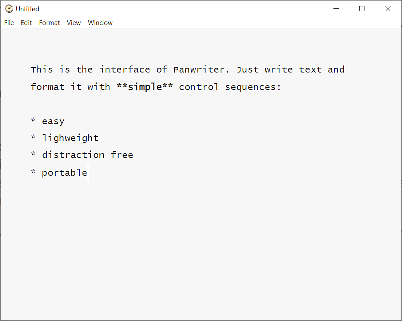
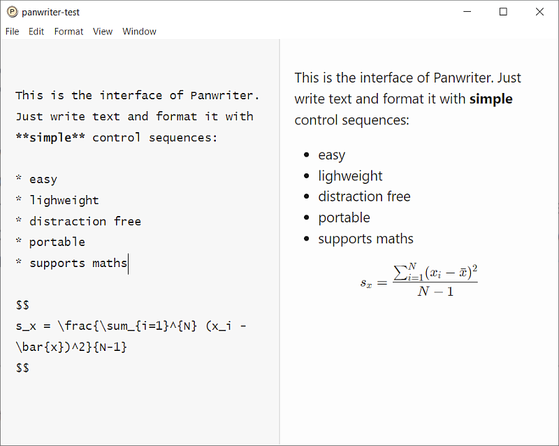

class: center, middle, title-slide

background-image: url("fig/water_tud_r_oer_by.png")

background-size: cover


<!-- Own title slide / -->

# A Small Introduction to (R)Markdown

#### Thomas Petzoldt

.small[Version `r Sys.Date()`, source code freely available from https://github.com/tpetzoldt/tpetzoldt.github.io/)]


--- 

Use cursor keys for navigation, press .red["O"] for a slide .red[O]verview

<!--
Verbatim code embedding:
https://themockup.blog/posts/2021-08-27-displaying-verbatim-code-chunks-in-xaringan-presentations/
-->

```{r setup, include=FALSE}
knitr::opts_chunk$set(echo = TRUE)
```

---

## Markdown

* "Markdown is a lightweight markup language for creating formatted text using a plain-text editor" [@Wikipedia_Markdown].
* Can be written with any text editor, less perfect than Latex, but much easier.
* Supported by many programs and services (e.g. Github, StackOverflow, Matrix, RStudio, ...)
* Markdown files have the file extension `.md`, RMarkdown files with extension `.Rmd` will be explained later.

A Markdown text is essentially a human readable text with some special formatting
conventions. To start a markdown document, open any text editor and start writing.

---

## Software

* You can any text editor, e.g. Notepad, Notepad++ or even Word
* Better: use an editor with Markdown support
    - RStudio
    - PanWriter, a basic writing program with an almost empty screen $\rightarrow$ distraction free writing
    - Joplin, a note taking program with cloud connectivity and encryption
    - man online services: Github, Gitlab, Stackoverflow, Matrix

---

## Panwriter

.center[

]

---

## Panwriter with Live-Preview

.center[

]

---

## More Software

https://softwarerecs.stackexchange.com/questions/5746/markdown-editor-for-windows-with-live-rendering-in-the-editing-pane-not-in-a-se


... and some other sites.

### Let's use RStudio ...

.center[

]

---

## Example

Section titles are introduced with one or several hash symbols `#`, `##`, praragraphs 
with empty lines, italic and bold face are indicated with one or two starts before 
and after a phrase, bullet points with a leading dash `-` or a star `*`. Weblinks 
are automatically activated. Here an example:

```
    # First level

    Text can be written with any ediror, that can be formatted, e.g. *slanted*, **boldface**,
    `verbatim text` weblinks: https://tu-dresden.de or bullet points:

    * point 1
    * point 2

    Section titles start with one or more hash tags
    
    
    ## Second level
    
    ### Third level
```

There are of course more formatting options, found in the docs or explained later.

---

## YAML Header

Often, markdown documents start with a few special lines 
enclosed within three dashes `---`. This so called "YAML header" is used to set
text conversion and formatting options:

```
    ---
    title: "Test"
    author: "Thomas Petzoldt"
    date: '2022-03-28'
    output: html_document
    ---
    
    # First Section

    Lorem ipsum dolor sit amet, consetetur sadipscing elitr, sed diam nonumy
    eirmod tempor invidunt ut labore et dolore magna aliquyam erat, sed diam
    voluptua.
    
    At vero eos et accusam et justo duo dolores et ea rebum.
    
    
    # Second Section
    
     
    Stet clita kasd gubergren, no sea takimata sanctus est Lorem ipsum 
    dolor sit amet. 
```

---


## Layout and format conversion

* User can concentrate on writing, formatting is done automatically.
* Several tools exist to convert markdown to other document formats.
* One of the most popular **pandoc** that is also built-in in **Rstudio**.


```{r diag-markdown1, echo=FALSE, fig.height=4, out.width="100%"}
library("DiagrammeR")
grViz("digraph pandoc {
         graph [rankdir = 'LR']
           node [shape = 'box', penwidth=1, fontname = 'Helvetica', 
                color='dodgerblue', style='filled', fontcolor='#006ab2' fillcolor='wheat']
                Markdown HTML PDF Word
           node [shape = cds, style='filled', fontsize=18, fontcolor='tomato', fillcolor='wheat']
             pandoc
           node [shape = oval, penwidth=0.5, style='cds' fixedsize=20 
                 fontsize=10 fontcolor='#93107d' style='filled', fillcolor='wheat']
             figs bib
           edge [penwidth=1.5]
             Markdown -> pandoc
             {figs bib} -> {pandoc}
             pandoc -> {HTML PDF Word}
}")
```


The pandoc utility converts markdown text in HTML for web pages, pdf for printing, or Word for further editing.

---

## What is Pandoc?

https://pandoc.org/

* Pandoc can do more than markdown
* It is said to be the "swiss-army knife" to convert between formats
* Open Source licensed: GPL 2.0
* Embedded in RStudio

---

## Exercise

* Write your first (?) markdown document in RStudio.
* Knit it to HTML and Word

### Optional without warranty:

* Create PDF output
* Needs LaTeX type setting system installed
* Can be done with R's tinytex package:

```{r, eval=FALSE}
install.packages("tinytex")
```

... configuration may need some trial and error.

---

## Weblinks


---

## Images


---

## Verbatim Text


---

## Tables


---

## Citations

---

## Mathematical Formulae

---


# R Markdown

R Markdown is an extension of Markdown from RStudio. It allows to embed 
R code to produce tables, data analyses and figures.

```{r diag-markdown2, echo=FALSE, fig.height=5, out.width="100%"}
grViz("digraph pandoc {
         graph [rankdir = 'LR']
           node [shape = 'box', penwidth=1, fontname = 'Helvetica', 
                color='dodgerblue', style='filled', fontcolor='#006ab2' fillcolor='wheat']
             RMarkdown Markdown HTML PDF Word
      
           node [shape = cds, style='filled', fontsize=18, fontcolor='tomato', fillcolor='wheat']
             knitr pandoc
      
           node [shape = oval, penwidth=0.5, style='cds' fixedsize=22
                 fontsize=10 fontcolor='#93107d' style='filled', fillcolor='wheat']
             R_Output figs R_figs bib csl
      
           edge [penwidth=1.5]
             RMarkdown -> knitr -> Markdown -> pandoc
             R_Output -> Markdown
             knitr -> {R_Output R_figs}
             {R_figs} -> {pandoc}
             pandoc -> {HTML PDF Word}
           edge [minlen=4 penwidth=1]
             {figs bib csl} -> pandoc
}")
```

---

## Creation of Markdown Documents

You can create a RMarkdown template from the File menu in RStudio. Then make your
changes and click the **Knit** button. Then, a document will be generated that 
includes both content as well as the output of any embedded R code chunks. 

Then you can embed an R code chunk like this:

````
```{r iris_summary}`r ''`
summary(iris)
```
````

To show both, the code and the output
```{r iris_summary}
summary(iris)
```

---

## Tables

This looks of course rather technical. If you want to include real tables, you 
can create the table in R and then format it with `knitr::kable`:

````
```{r iris_table}`r ''`
knitr::kable(iris[1:4, ])
```
````

```{r iris_table}
knitr::kable(iris[1:4, ])
```


The `kable` function has several functions for configuring table layout, see 
`kable` help page for details.

---

## Include Plots

You can also embed plots, for example:

````
```{r iris_sepal}`r ''`
plot(Sepal.Width ~ Sepal.Length, data=iris, pch=16, col=Species)
```
````


```{r iris_sepal2, fig.height=4, fig.width=4, fig.align="center"}
plot(Sepal.Width ~ Sepal.Length, data=iris, pch=16, col=Species)
```


---

## Suppress Code


The code chunks can be modified with additional options. In the following example
the figure size is adjusted and an option `echo = FALSE` was added to prevent 
printing of the R code that generated the plot.

````
```{r iris_sepal3, fig.width=5, fig.height=5, echo=FALSE}`r ''`
plot(Sepal.Width ~ Sepal.Length, data=iris, pch=16, col=Species)
```
````

The plot is then shown without the code:

```{r iris_sepal3, fig.width=5, fig.height=5, echo=FALSE, fig.align="center"}
plot(Sepal.Width ~ Sepal.Length, data=iris, pch=16, col=Species)
```


---

## Further reading

For more details on using  R Markdown see <http://rmarkdown.rstudio.com>.

The [Rmarkdown cheat sheet](https://raw.githubusercontent.com/rstudio/cheatsheets/main/rmarkdown.pdf) can serve as a reference.

---
## References

